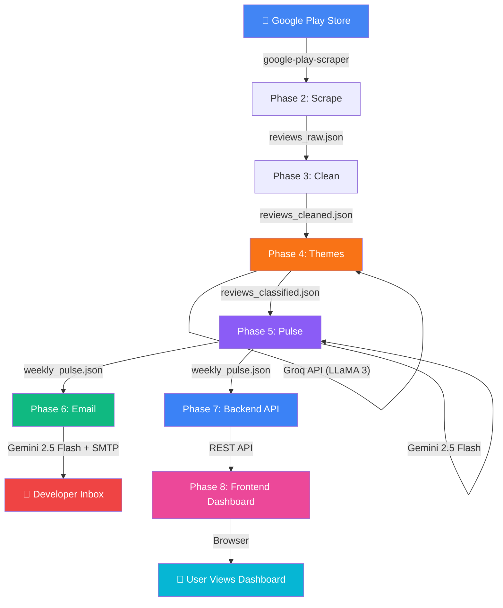
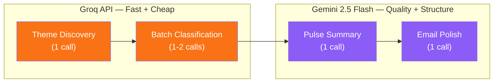
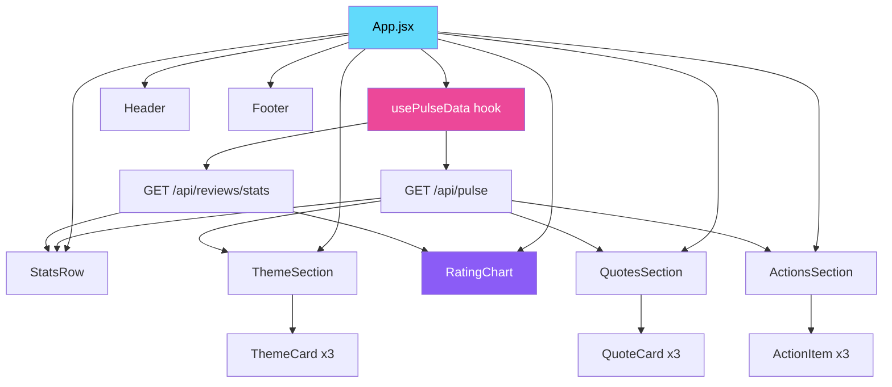

# 🏗️ INDMoney Weekly Pulse — System Architecture

> Complete architectural reference for the AI-powered Play Store review insights platform.

---

## 1. High-Level System Overview

The system is a **10-phase, linear Python pipeline + web dashboard** that converts raw Google Play Store reviews into a polished weekly product-health report. No message queues, no complex orchestration — just clean, phase-based execution.

```
┌──────────────────────────────────────────────────────────────────────────────────────────────────────────┐
│                                      WEEKLY PULSE PLATFORM                                               │
│                                                                                                          │
│  DATA PIPELINE                                                                                           │
│  ┌──────────┐  ┌──────────┐  ┌──────────┐  ┌──────────┐  ┌──────────┐  ┌──────────┐                    │
│  │ Phase 1  │─▶│ Phase 2  │─▶│ Phase 3  │─▶│ Phase 4  │─▶│ Phase 5  │─▶│ Phase 6  │                    │
│  │ Setup    │  │ Scrape   │  │ Clean    │  │ Themes   │  │ Pulse    │  │ Email    │                    │
│  └──────────┘  └──────────┘  └──────────┘  └──────────┘  └──────────┘  └──────────┘                    │
│       │            │            │             │              │              │                             │
│    .env        Play Store    Regex/NLP     Groq API     Gemini 2.5     Gmail SMTP                        │
│                                             LLaMA 3      Flash                                           │
│                                                                                                          │
│  WEB LAYER                                                                                               │
│  ┌──────────┐  ┌──────────┐                                                                              │
│  │ Phase 7  │◀▶│ Phase 8  │                                                                              │
│  │ Backend  │  │ Frontend │                                                                              │
│  │ (FastAPI)│  │ (React)  │                                                                              │
│  └──────────┘  └──────────┘                                                                              │
│       │              │                                                                                   │
│    REST API      Dashboard                                                                               │
│                                                                                                          │
│  DEPLOYMENT                                                                                              │
│  ┌──────────┐  ┌──────────┐                                                                              │
│  │ Phase 9  │  │ Phase 10 │                                                                              │
│  │ Docker   │  │ Scheduler│                                                                              │
│  └──────────┘  └──────────┘                                                                              │
│       │              │                                                                                   │
│   Container     GitHub Actions                                                                           │
└──────────────────────────────────────────────────────────────────────────────────────────────────────────┘
```

---

## 2. Phase Map

| Phase | Folder | Purpose | Technology | Depends On |
|-------|--------|---------|------------|------------|
| **1** | `phase1_setup/` | Project config, env vars, logging, LLM clients | python-dotenv | — |
| **2** | `phase2_scraper/` | Scrape Play Store reviews | google-play-scraper | Phase 1 |
| **3** | `phase3_cleaning/` | PII removal & data normalisation | Regex (stdlib) | Phase 2 |
| **4** | `phase4_themes/` | Theme discovery + review classification | **Groq** (LLaMA 3 70B) | Phase 3 |
| **5** | `phase5_pulse/` | Generate weekly pulse summary | **Gemini 2.5 Flash** | Phase 4 |
| **6** | `phase6_email/` | Draft HTML email & send via Gmail | **Gemini 2.5 Flash** + SMTP | Phase 5 |
| **7** | `phase7_backend/` | REST API serving pulse data | **FastAPI** | Phase 5 |
| **8** | `phase8_frontend/` | Interactive dashboard UI | **React** (Vite) | Phase 7 |
| **9** | `phase9_docker/` | Docker containerisation | Docker | All |
| **10** | `phase10_scheduler/` | GitHub Actions cron automation | GitHub Actions | Phase 9 |

---

## 3. Data Flow Diagram



### File-Based Data Flow

```
data/
├── reviews_raw.json          ← Phase 2 writes  → Phase 3 reads
├── reviews_cleaned.json      ← Phase 3 writes  → Phase 4 reads
├── reviews_classified.json   ← Phase 4 writes  → Phase 5 reads
├── weekly_pulse.json         ← Phase 5 writes  → Phase 6, 7 read
└── email_draft.html          ← Phase 6 writes  (also sends email)
```

---

## 4. Phase-Wise Deep Dive

### Phase 1 — Setup & Configuration

```
Responsibility:
  ├── Load environment variables from .env via python-dotenv
  ├── Initialise Groq client wrapper
  ├── Initialise Gemini 2.5 Flash client wrapper
  ├── Configure structured logging with timestamps
  ├── Export shared constants:
  │     APP_ID = "in.indwealth"
  │     DATE_WINDOW_WEEKS = 8
  │     MAX_REVIEWS = 200
  │     GROQ_MODEL = "llama3-70b-8192"
  │     GEMINI_MODEL = "gemini-2.5-flash-preview-04-17"
  └── Validate all required env vars exist on startup
```

**Files:** `config.py`, `llm_clients.py`, `logger.py`

---

### Phase 2 — Review Scraping

```
Input:  App ID (in.indwealth)
Output: data/reviews_raw.json

Flow:
  google-play-scraper.reviews()
        │
        ▼
  Sort by NEWEST, fetch up to 1000
        │
        ▼
  Filter: date >= (today - 8 weeks)
        │
        ▼
  Deduplicate by review_id
        │
        ▼
  Cap at 200 reviews for LLM cost control
        │
        ▼
  Save → data/reviews_raw.json

Schema per review:
  {
    review_id, rating (1-5), title, text,
    date (YYYY-MM-DD), thumbs_up
  }
```

**Files:** `scraper.py`

---

### Phase 3 — Data Cleaning & PII Removal

```
Input:  data/reviews_raw.json
Output: data/reviews_cleaned.json

Flow:
  Load raw reviews
        │
        ▼
  Regex PII stripping:
    ├── Emails:    [\w.-]+@[\w.-]+\.\w+  →  [EMAIL]
    ├── Phones:    \+?\d[\d\s-]{7,}\d    →  [PHONE]
    └── Aadhaar:   \d{4}\s?\d{4}\s?\d{4} →  [ID]
        │
        ▼
  Normalise whitespace, fix encoding
        │
        ▼
  Remove reviews with < 10 chars of text
        │
        ▼
  Save → data/reviews_cleaned.json
```

**Files:** `cleaner.py`

---

### Phase 4 — Theme Generation & Classification (Groq)

```
Input:  data/reviews_cleaned.json
Output: data/reviews_classified.json
LLM:    Groq API — LLaMA 3 70B (llama3-70b-8192)

Step 1 — Theme Discovery (1 LLM call)
  ┌──────────────────────────────────────────┐
  │  System: You are a product analyst.      │
  │  Prompt: Given these 200 reviews,        │
  │  identify 3-5 product-related themes.    │
  │  Output: JSON array of theme names       │
  └──────────────────────────────────────────┘
              │
              ▼
Step 2 — Batch Classification (1-2 LLM calls)
  ┌──────────────────────────────────────────┐
  │  Prompt: Classify each review into one   │
  │  of these themes: [Theme1, Theme2, ...]  │
  │  Output: {review_id: theme} mapping      │
  └──────────────────────────────────────────┘
              │
              ▼
  Merge theme labels → save reviews_classified.json
```

**Why Groq?** ~500 tokens/sec, very low cost, ideal for classification.

**Files:** `theme_generator.py`

---

### Phase 5 — Weekly Pulse Generation (Gemini 2.5 Flash)

```
Input:  data/reviews_classified.json
Output: data/weekly_pulse.json
LLM:    Google Gemini 2.5 Flash

Flow:
  Aggregate stats per theme (count, avg rating)
        │
        ▼
  Rank themes by review count → top 3
        │
        ▼
  Single Gemini 2.5 Flash call:
  ┌──────────────────────────────────────────┐
  │  System: You are a senior product        │
  │  analyst at a fintech company.           │
  │                                          │
  │  Prompt: Given classified reviews:       │
  │  1. Explain top 3 themes for leadership  │
  │  2. Pick 3 anonymised, impactful quotes  │
  │  3. Suggest 3 product improvements       │
  │                                          │
  │  Output: Structured JSON pulse object    │
  └──────────────────────────────────────────┘
        │
        ▼
  Validate schema → save weekly_pulse.json
```

**Why Gemini 2.5 Flash?** Best-in-class structured summarisation, strong reasoning, leadership-grade language quality, fast and cost-efficient.

**Files:** `pulse_generator.py`

---

### Phase 6 — Email Draft & Delivery (Gemini 2.5 Flash)

```
Input:  data/weekly_pulse.json + templates/email_template.html
Output: data/email_draft.html + email sent
LLM:    Gemini 2.5 Flash (prose polishing)

Flow:
  Load pulse JSON
        │
        ▼
  Gemini 2.5 Flash: polish into professional prose (1 call)
        │
        ▼
  Render HTML via Jinja2 template
        │
        ▼
  Save → data/email_draft.html
        │
        ▼
  SMTP_SSL("smtp.gmail.com", 465)
  Authenticate → Send → ✅
```

**Files:** `email_sender.py`, `templates/email_template.html`

---

### Phase 7 — Backend API (FastAPI)

```
Input:  data/*.json (pipeline outputs)
Output: REST API endpoints

Endpoints:
  GET  /health                → { status: "ok" }
  GET  /api/pulse             → Latest weekly_pulse.json
  GET  /api/pulse/themes      → Theme breakdown with stats
  GET  /api/pulse/quotes      → Anonymised user quotes
  GET  /api/pulse/actions     → Suggested product actions
  GET  /api/reviews           → Classified reviews (paginated)
  GET  /api/reviews/stats     → Rating distribution, counts
  POST /api/pipeline/run      → Trigger pipeline manually

CORS:
  Allow React dev server (localhost:5173) + production origin

Static Files:
  Serve React production build from phase8_frontend/dist/
```

**Why FastAPI?** Async, auto-docs (Swagger), type-safe, Python-native.

**Files:** `app.py`, `routes.py`

---

### Phase 8 — Frontend Dashboard (React)

```
Input:  Backend API endpoints (Phase 7)
Output: Interactive single-page React dashboard

Tech Stack:
  - React 18 (component-based UI)
  - Vite (fast build tooling)
  - CSS Modules or vanilla CSS (dark mode, glassmorphism)
  - Recharts (rating distribution charts)
  - Axios or fetch (API calls to backend)

React Component Tree:
  <App />
  ├── <Header />            # Title, week range, refresh button
  ├── <StatsRow />           # 4 metric cards (reviews, rating, themes, email)
  │   └── <StatCard />       # Reusable stat display component
  ├── <ThemeSection />       # Top 3 theme cards grid
  │   └── <ThemeCard />      # Glass-effect card with theme details
  ├── <RatingChart />        # Horizontal bar chart (Recharts)
  ├── <QuotesSection />      # User quote cards
  │   └── <QuoteCard />      # Styled quote with star rating
  ├── <ActionsSection />     # Recommended actions list
  │   └── <ActionItem />     # Individual action with rationale
  └── <Footer />             # Generation timestamp, credits

Dashboard Wireframe:
  ┌────────────────────────────────────────────────┐
  │  📊 INDMoney Weekly Pulse Dashboard            │
  ├────────────────────────────────────────────────┤
  │                                                │
  │  ┌─────────┐  ┌─────────┐  ┌─────────┐       │
  │  │ Total   │  │ Avg     │  │ Top     │       │
  │  │ Reviews │  │ Rating  │  │ Theme   │       │
  │  │   187   │  │  ★3.2   │  │ Perf.   │       │
  │  └─────────┘  └─────────┘  └─────────┘       │
  │                                                │
  │  ── Theme Cards (CSS Grid) ───────────────    │
  │  ┌──────────────┐  ┌──────────────┐           │
  │  │App Performance│  │Investment    │           │
  │  │47 reviews     │  │Features      │           │
  │  │★2.3 avg       │  │38 reviews    │           │
  │  └──────────────┘  │★3.8 avg      │           │
  │                     └──────────────┘           │
  │                                                │
  │  ── Rating Distribution (Recharts) ───────    │
  │  ★5 ████████████  32                           │
  │  ★4 ████████  24                               │
  │  ★3 ██████  18                                 │
  │  ★2 ████████████████  52                       │
  │  ★1 ██████████████████████  61                 │
  │                                                │
  │  ── User Quotes ──────────────────────────    │
  │  💬 "The app freezes every time..." (★2)       │
  │  💬 "Love the SIP tracker!" (★4)               │
  │                                                │
  │  ── Action Ideas ─────────────────────────    │
  │  → Optimise cold-start latency                 │
  │  → Add fund comparison feature                 │
  │                                                │
  └────────────────────────────────────────────────┘
```

**Folder:** `phase8_frontend/` (Vite React app initialised via `npx create-vite`)

**Key Files:**
```
phase8_frontend/
├── src/
│   ├── App.jsx              # Root component
│   ├── App.css              # Global dark-mode styles
│   ├── main.jsx             # React entry point
│   ├── components/
│   │   ├── Header.jsx
│   │   ├── StatsRow.jsx
│   │   ├── StatCard.jsx
│   │   ├── ThemeSection.jsx
│   │   ├── ThemeCard.jsx
│   │   ├── RatingChart.jsx
│   │   ├── QuotesSection.jsx
│   │   ├── QuoteCard.jsx
│   │   ├── ActionsSection.jsx
│   │   └── ActionItem.jsx
│   ├── hooks/
│   │   └── usePulseData.js  # Custom hook for API calls
│   └── utils/
│       └── api.js           # Axios/fetch wrapper
├── index.html
├── vite.config.js           # Proxy to backend during dev
└── package.json
```

---

### Phase 9 — Docker Containerisation

```
┌──────────────────────────────────────────────┐
│           Docker Container                   │
│                                              │
│  FROM python:3.11-slim                       │
│  WORKDIR /app                                │
│                                              │
│  COPY requirements.txt → pip install         │
│  COPY . .                                    │
│                                              │
│  ENV:                                        │
│    GROQ_API_KEY                              │
│    GEMINI_API_KEY                            │
│    EMAIL_ADDRESS                             │
│    EMAIL_APP_PASSWORD                        │
│    PORT=8000                                 │
│                                              │
│  Modes:                                      │
│   CMD ["python", "main.py"]      # Pipeline │
│   CMD ["uvicorn", "...app:app"]  # Server   │
└──────────────────────────────────────────────┘
```

**Files:** `Dockerfile`, `.dockerignore` (at repo root)

---

### Phase 10 — GitHub Actions Scheduler

```
.github/workflows/weekly_pulse.yml

Trigger:
  ├── cron: "0 9 * * 1"  (Every Monday 9 AM UTC)
  └── workflow_dispatch   (Manual trigger button)

Steps:
  1. Checkout repo
  2. Setup Python 3.11
  3. Install dependencies
  4. Run: python main.py
  5. Upload data/ artifacts (retained 30 days)

Secrets:
  GROQ_API_KEY, GEMINI_API_KEY,
  EMAIL_ADDRESS, EMAIL_APP_PASSWORD
```

**Files:** `.github/workflows/weekly_pulse.yml`

---

## 5. LLM Interaction Design



| # | Phase | Provider | Model | Calls | Purpose |
|---|-------|----------|-------|-------|---------|
| 1 | Phase 4 | **Groq** | `llama3-70b-8192` | 1 | Generate 3–5 themes |
| 2 | Phase 4 | **Groq** | `llama3-70b-8192` | 1–2 | Batch classify reviews |
| 3 | Phase 5 | **Gemini** | `gemini-2.5-flash-preview-04-17` | 1 | Generate pulse JSON |
| 4 | Phase 6 | **Gemini** | `gemini-2.5-flash-preview-04-17` | 1 | Polish email prose |

**Total LLM calls per run: 4–5 · ~30K tokens**

### Token Budget Estimate

| Call | Input Tokens | Output Tokens | Cost (est.) |
|------|------------:|-------------:|------------:|
| Theme discovery | ~8,000 | ~200 | ~$0.002 |
| Batch classification | ~10,000 | ~2,000 | ~$0.003 |
| Pulse generation | ~6,000 | ~1,500 | ~$0.001 |
| Email polish | ~2,000 | ~1,000 | ~$0.001 |
| **Total** | **~26,000** | **~4,700** | **~$0.007** |

---

## 6. Repository Structure

```
WeeklyPulse_PlaystoreReviews/
│
├── main.py                              # 🚀 Pipeline orchestrator
│
├── phase1_setup/                        # ⚙️ Config & Clients
│   ├── README.md
│   ├── __init__.py
│   ├── config.py                        # Env vars & constants
│   ├── llm_clients.py                   # Groq + Gemini 2.5 Flash wrappers
│   └── logger.py                        # Structured logging
│
├── phase2_scraper/                      # 📥 Review Ingestion
│   ├── README.md
│   ├── __init__.py
│   └── scraper.py                       # Play Store scraping
│
├── phase3_cleaning/                     # 🧹 Data Cleaning
│   ├── README.md
│   ├── __init__.py
│   └── cleaner.py                       # PII removal & normalisation
│
├── phase4_themes/                       # 🏷️ Theme Generation
│   ├── README.md
│   ├── __init__.py
│   └── theme_generator.py              # Groq LLaMA 3 theming
│
├── phase5_pulse/                        # 📊 Pulse Generation
│   ├── README.md
│   ├── __init__.py
│   └── pulse_generator.py              # Gemini 2.5 Flash summaries
│
├── phase6_email/                        # 📧 Email Delivery
│   ├── README.md
│   ├── __init__.py
│   ├── email_sender.py                  # Draft + SMTP delivery
│   └── templates/
│       └── email_template.html          # Jinja2 HTML template
│
├── phase7_backend/                      # 🖥️ Backend API
│   ├── README.md
│   ├── __init__.py
│   ├── app.py                           # FastAPI application
│   └── routes.py                        # API route handlers
│
├── phase8_frontend/                     # 🎨 Frontend Dashboard (React)
│   ├── README.md
│   ├── index.html                       # Vite entry HTML
│   ├── vite.config.js                   # Vite config + backend proxy
│   ├── package.json                     # React dependencies
│   └── src/
│       ├── App.jsx                      # Root component
│       ├── App.css                      # Global dark-mode styles
│       ├── main.jsx                     # React entry point
│       ├── components/                  # Reusable UI components
│       ├── hooks/                       # Custom React hooks
│       └── utils/                       # API helper functions
│
├── phase9_docker/                       # 🐳 Containerisation
│   └── README.md                        # Docker instructions
│
├── phase10_scheduler/                   # ⏰ GitHub Actions
│   └── README.md                        # Scheduler instructions
│
├── .github/
│   └── workflows/
│       └── weekly_pulse.yml             # Cron workflow
│
├── architecture/
│   └── architecture.md                  # This document
│
├── data/                                # Runtime outputs (gitignored)
│   ├── reviews_raw.json
│   ├── reviews_cleaned.json
│   ├── reviews_classified.json
│   ├── weekly_pulse.json
│   └── email_draft.html
│
├── Dockerfile
├── .dockerignore
├── .env.example
├── .gitignore
├── requirements.txt
└── README.md
```

---

## 7. Backend Architecture (Phase 7)

```mermaid
flowchart TD
    A["FastAPI Server\n:8000"] --> B["GET /api/pulse"]
    A --> C["GET /api/pulse/themes"]
    A --> D["GET /api/pulse/quotes"]
    A --> E["GET /api/pulse/actions"]
    A --> F["GET /api/reviews"]
    A --> G["GET /api/reviews/stats"]
    A --> H["POST /api/pipeline/run"]
    A --> I["GET /health"]
    A --> J["Static Files\n(React build)"]

    B & C & D & E --> K["data/weekly_pulse.json"]
    F & G --> L["data/reviews_classified.json"]
    H --> M["main.py pipeline"]
    J --> N["phase8_frontend/dist/"

    style A fill:#3B82F6,color:#fff
    style K fill:#10B981,color:#fff
    style L fill:#10B981,color:#fff
    style N fill:#EC4899,color:#fff
```

---

## 8. Frontend Architecture (Phase 8 — React)



### Dashboard Wireframe

```
┌──────────────────────────────────────────────────────────┐
│  📊 INDMoney Weekly Pulse Dashboard                      │
│  Week of Mar 06 – Mar 13, 2026                           │
├──────────────────────────────────────────────────────────┤
│                                                          │
│  ┌──────────┐  ┌──────────┐  ┌──────────┐  ┌──────────┐│
│  │ 📝 187   │  │ ⭐ 3.2   │  │ 🏷️ 5     │  │ 📧 Sent  ││
│  │ Reviews  │  │ Avg Rate │  │ Themes   │  │ Status   ││
│  └──────────┘  └──────────┘  └──────────┘  └──────────┘│
│                                                          │
│  ── 🏷️ Theme Breakdown ─────────────────────────────    │
│  ┌────────────────────┐  ┌────────────────────┐         │
│  │ 🔴 App Performance │  │ 🟡 Investment      │         │
│  │ 47 reviews · ★2.3  │  │ Features           │         │
│  │ Crashes, slow load  │  │ 38 reviews · ★3.8  │         │
│  └────────────────────┘  │ SIP, MF comparison  │         │
│  ┌────────────────────┐  └────────────────────┘         │
│  │ 🟠 Customer Support│                                  │
│  │ 32 reviews · ★2.1  │                                  │
│  │ Slow responses      │                                  │
│  └────────────────────┘                                  │
│                                                          │
│  ── 📊 Rating Distribution ─────────────────────────    │
│  ★5  ████████████  32                                    │
│  ★4  ████████  24                                        │
│  ★3  ██████  18                                          │
│  ★2  ████████████████  52                                │
│  ★1  ██████████████████████  61                          │
│                                                          │
│  ── 💬 User Voices ─────────────────────────────────    │
│  "The app freezes every time I try to..." (★2)           │
│  "Love the SIP tracker..." (★4)                          │
│  "Raised a ticket 4 days ago..." (★1)                    │
│                                                          │
│  ── 🎯 Action Ideas ───────────────────────────────    │
│  → Optimise cold-start latency                           │
│  → Add mutual fund comparison feature                    │
│  → Implement SLA-based ticket escalation                 │
│                                                          │
└──────────────────────────────────────────────────────────┘
```

---

## 9. Security & Privacy

| Concern | Mitigation |
|---------|------------|
| PII in reviews | Phase 3 strips emails, phone numbers, ID patterns |
| API keys | Environment variables only — never committed |
| Email credentials | Gmail App Password, not main password |
| LLM data exposure | All PII removed before any LLM call (Phase 3) |
| Docker secrets | `.env` in `.dockerignore` + `.gitignore` |
| GitHub secrets | Stored in repo Settings → Secrets → Actions |
| API access | Backend CORS configured for specific origins |

---

## 10. Error Handling Strategy

| Phase | Failure Mode | Recovery |
|-------|-------------|----------|
| Phase 2 | Play Store rate-limit | Retry with exponential backoff (max 3) |
| Phase 3 | Regex edge case | Log warning; preserve original text |
| Phase 4 | Groq API timeout | Retry once; fallback to smaller batch |
| Phase 5 | Gemini 2.5 Flash error | Retry once; save partial output |
| Phase 6 | SMTP auth failure | Save draft locally; log error |
| Phase 7 | Backend crash | FastAPI exception handlers; return 500 JSON |
| Phase 8 | API unreachable | Frontend shows "data unavailable" state |
| Phase 10 | GitHub Actions failure | GitHub email notification; manual re-trigger |

---

## 11. Execution Modes

### Mode 1 — Pipeline Only (Headless)

```bash
python main.py
# Runs: Phase 1 → 2 → 3 → 4 → 5 → 6 (email sent)
```

### Mode 2 — Dashboard Server

```bash
uvicorn phase7_backend.app:app --port 8000
# Serves: Backend API + Frontend Dashboard
# Access: http://localhost:8000
```

### Mode 3 — Full Platform (Docker)

```bash
docker run --env-file .env weekly-pulse
# Runs pipeline first, then starts the server
```

---

## 12. Execution Timeline

```mermaid
gantt
    title Pipeline Execution Timeline
    dateFormat X
    axisFormat %s

    section Data Collection
    Phase 2 - Scrape Reviews    :0, 30
    Phase 3 - Clean & Strip PII :30, 40

    section AI Processing
    Phase 4 - Theme Generation  :40, 60
    Phase 5 - Pulse Generation  :60, 75

    section Delivery
    Phase 6 - Email & Send      :75, 90

    section Web
    Phase 7 - Backend Start     :90, 95
    Phase 8 - Frontend Served   :95, 100
```



**Typical execution time: ~90 seconds for pipeline + instant server start**
