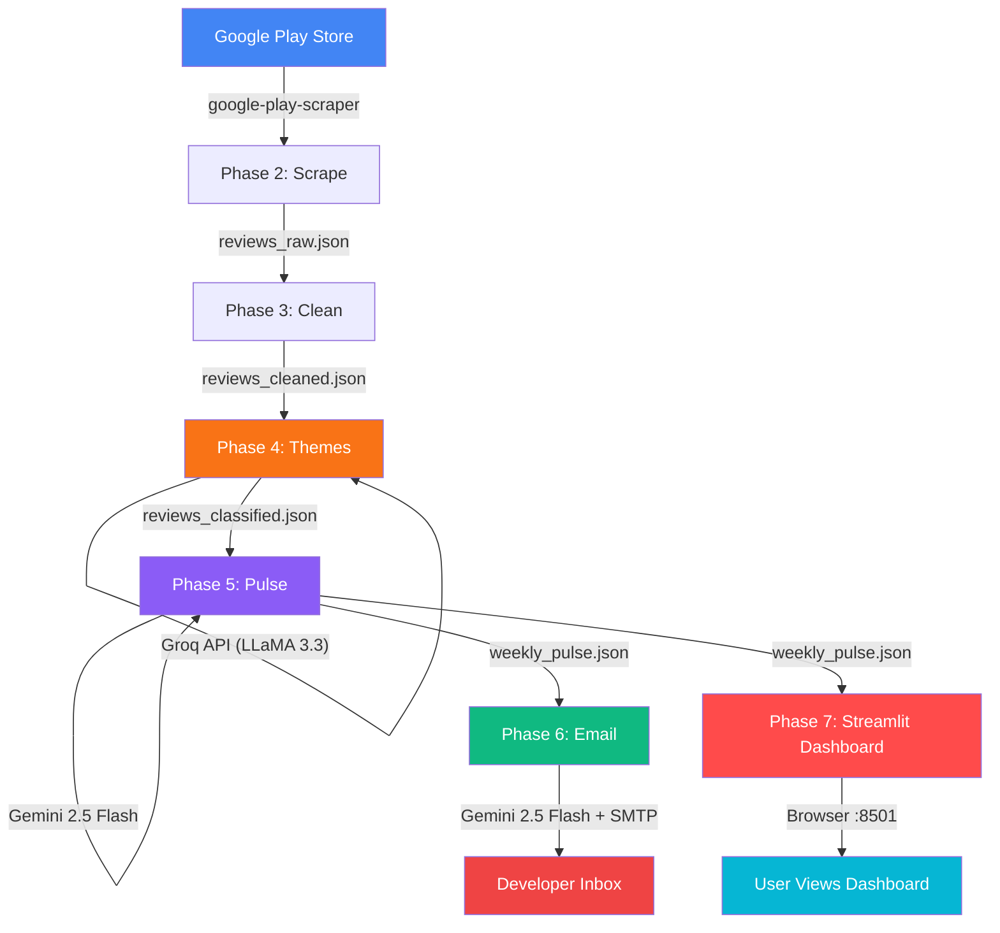
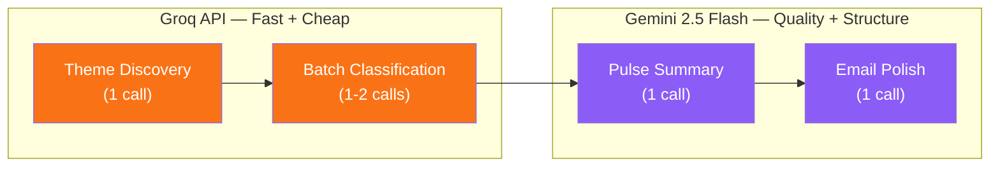
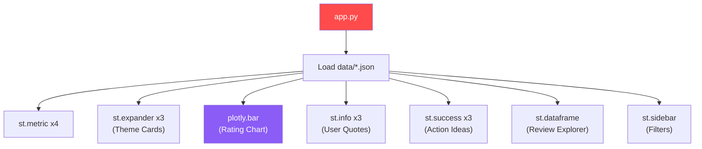

# 🏗️ INDMoney Weekly Pulse — System Architecture

> Complete architectural reference for the AI-powered Play Store review insights platform.

---

## 1. High-Level System Overview

The system is a **9-phase, linear Python pipeline + Streamlit dashboard** that converts raw Google Play Store reviews into a polished weekly product-health report. No message queues, no complex orchestration — just clean, phase-based execution.

```
┌──────────────────────────────────────────────────────────────────────────────────────────────┐
│                                      WEEKLY PULSE PLATFORM                                   │
│                                                                                              │
│  DATA PIPELINE                                                                               │
│  ┌──────────┐  ┌──────────┐  ┌──────────┐  ┌──────────┐  ┌──────────┐  ┌──────────┐        │
│  │ Phase 1  │─▶│ Phase 2  │─▶│ Phase 3  │─▶│ Phase 4  │─▶│ Phase 5  │─▶│ Phase 6  │        │
│  │ Setup    │  │ Scrape   │  │ Clean    │  │ Themes   │  │ Pulse    │  │ Email    │        │
│  └──────────┘  └──────────┘  └──────────┘  └──────────┘  └──────────┘  └──────────┘        │
│       │            │            │             │              │              │                 │
│    .env        Play Store    Regex/NLP     Groq API     Gemini 2.5     Gmail SMTP            │
│                                            LLaMA 3.3     Flash                               │
│                                                                                              │
│  DASHBOARD                                                                                   │
│  ┌──────────────────────┐                                                                    │
│  │     Phase 7          │                                                                    │
│  │  Streamlit Dashboard │                                                                    │
│  │  (reads data/*.json) │                                                                    │
│  └──────────────────────┘                                                                    │
│           │                                                                                  │
│      http://localhost:8501                                                                    │
│                                                                                              │
│  DEPLOYMENT                                                                                  │
│  ┌──────────┐  ┌──────────┐                                                                  │
│  │ Phase 8  │  │ Phase 9  │                                                                  │
│  │ Docker   │  │ Scheduler│                                                                  │
│  └──────────┘  └──────────┘                                                                  │
│       │              │                                                                       │
│   Container     GitHub Actions                                                               │
└──────────────────────────────────────────────────────────────────────────────────────────────┘
```

---

## 2. Phase Map

| Phase | Folder | Purpose | Technology | Depends On |
|-------|--------|---------|------------|------------|
| **1** | `phase1_setup/` | Project config, env vars, logging, LLM clients | python-dotenv | — |
| **2** | `phase2_scraper/` | Scrape Play Store reviews | google-play-scraper | Phase 1 |
| **3** | `phase3_cleaning/` | PII removal & data normalisation | Regex (stdlib) | Phase 2 |
| **4** | `phase4_themes/` | Theme discovery + review classification | **Groq** (LLaMA 3.3 70B) | Phase 3 |
| **5** | `phase5_pulse/` | Generate weekly pulse summary | **Gemini 2.5 Flash** | Phase 4 |
| **6** | `phase6_email/` | Draft HTML email & send via Gmail | **Gemini 2.5 Flash** + SMTP | Phase 5 |
| **7** | `phase7_dashboard/` | Interactive Streamlit dashboard | **Streamlit** + Plotly | Phase 5 |
| **8** | `phase8_docker/` | Docker containerisation | Docker | All |
| **9** | `phase9_scheduler/` | GitHub Actions cron automation | GitHub Actions | Phase 8 |

---

## 3. Data Flow Diagram



### File-Based Data Flow

```
data/
├── reviews_raw.json          ← Phase 2 writes  → Phase 3 reads
├── reviews_cleaned.json      ← Phase 3 writes  → Phase 4 reads
├── reviews_classified.json   ← Phase 4 writes  → Phase 5 reads, Phase 7 reads
├── weekly_pulse.json         ← Phase 5 writes  → Phase 6, 7 read
└── email_draft.html          ← Phase 6 writes  (also sends email)
```

---

## 4. Phase-Wise Deep Dive

### Phase 1 — Setup & Configuration

```
Responsibility:
  ├── Load environment variables from .env via python-dotenv
  ├── Initialise Groq client wrapper
  ├── Initialise Gemini 2.5 Flash client wrapper
  ├── Configure structured logging with timestamps
  ├── Export shared constants:
  │     APP_ID = "in.indwealth"
  │     DATE_WINDOW_WEEKS = 8
  │     MAX_REVIEWS = 200
  │     GROQ_MODEL = "llama-3.3-70b-versatile"
  │     GEMINI_MODEL = "gemini-2.5-flash"
  └── Validate all required env vars exist on startup
```

**Folder:** `phase1_setup/`
**Files:** `config.py`, `llm_clients.py`, `logger.py`
**Status:** ✅ Implemented & Tested (6/6 tests pass)

---

### Phase 2 — Review Scraping

```
Input:  App ID (in.indwealth)
Output: data/reviews_raw.json

Flow:
  google-play-scraper.reviews()
        │
        ▼
  Sort by NEWEST, fetch up to 1000
        │
        ▼
  Filter: date >= (today - 8 weeks)
        │
        ▼
  Deduplicate by review_id
        │
        ▼
  Cap at 200 reviews for LLM cost control
        │
        ▼
  Save → data/reviews_raw.json

Schema per review:
  {
    review_id, rating (1-5), title, text,
    date (YYYY-MM-DD), thumbs_up
  }
```

**Folder:** `phase2_scraper/`
**Files:** `scraper.py`

---

### Phase 3 — Data Cleaning & PII Removal

```
Input:  data/reviews_raw.json
Output: data/reviews_cleaned.json

Flow:
  Load raw reviews
        │
        ▼
  Regex PII stripping:
    ├── Emails:    [\w.-]+@[\w.-]+\.\w+  →  [EMAIL]
    ├── Phones:    \+?\d[\d\s-]{7,}\d    →  [PHONE]
    └── Aadhaar:   \d{4}\s?\d{4}\s?\d{4} →  [ID]
        │
        ▼
  Normalise whitespace, fix encoding
        │
        ▼
  Remove reviews with < 10 chars of text
        │
        ▼
  Save → data/reviews_cleaned.json
```

**Folder:** `phase3_cleaning/`
**Files:** `cleaner.py`

---

### Phase 4 — Theme Generation & Classification (Groq)

```
Input:  data/reviews_cleaned.json
Output: data/reviews_classified.json
LLM:    Groq API — LLaMA 3.3 70B (llama-3.3-70b-versatile)

Step 1 — Theme Discovery (1 LLM call)
  ┌──────────────────────────────────────────┐
  │  System: You are a product analyst.      │
  │  Prompt: Given these 200 reviews,        │
  │  identify 3-5 product-related themes.    │
  │  Output: JSON array of theme names       │
  └──────────────────────────────────────────┘
              │
              ▼
Step 2 — Batch Classification (1-2 LLM calls)
  ┌──────────────────────────────────────────┐
  │  Prompt: Classify each review into one   │
  │  of these themes: [Theme1, Theme2, ...]  │
  │  Output: {review_id: theme} mapping      │
  └──────────────────────────────────────────┘
              │
              ▼
  Merge theme labels → save reviews_classified.json
```

**Why Groq?** ~500 tokens/sec, very low cost, ideal for classification.

**Folder:** `phase4_themes/`
**Files:** `theme_generator.py`

---

### Phase 5 — Weekly Pulse Generation (Gemini 2.5 Flash)

```
Input:  data/reviews_classified.json
Output: data/weekly_pulse.json
LLM:    Google Gemini 2.5 Flash

Flow:
  Aggregate stats per theme (count, avg rating)
        │
        ▼
  Rank themes by review count → top 3
        │
        ▼
  Single Gemini 2.5 Flash call:
  ┌──────────────────────────────────────────┐
  │  System: You are a senior product        │
  │  analyst at a fintech company.           │
  │                                          │
  │  Prompt: Given classified reviews:       │
  │  1. Explain top 3 themes for leadership  │
  │  2. Pick 3 anonymised, impactful quotes  │
  │  3. Suggest 3 product improvements       │
  │                                          │
  │  Output: Structured JSON pulse object    │
  └──────────────────────────────────────────┘
        │
        ▼
  Validate schema → save weekly_pulse.json
```

**Why Gemini 2.5 Flash?** Best-in-class structured summarisation, strong reasoning, leadership-grade language quality, fast and cost-efficient.

**Folder:** `phase5_pulse/`
**Files:** `pulse_generator.py`

---

### Phase 6 — Email Draft & Delivery (Gemini 2.5 Flash)

```
Input:  data/weekly_pulse.json + templates/email_template.html
Output: data/email_draft.html + email sent
LLM:    Gemini 2.5 Flash (prose polishing)

Flow:
  Load pulse JSON
        │
        ▼
  Gemini 2.5 Flash: polish into professional prose (1 call)
        │
        ▼
  Render HTML via Jinja2 template
        │
        ▼
  Save → data/email_draft.html
        │
        ▼
  SMTP_SSL("smtp.gmail.com", 465)
  Authenticate → Send → Done
```

**Folder:** `phase6_email/`
**Files:** `email_sender.py`, `templates/email_template.html`

---

### Phase 7 — Streamlit Dashboard

```
Input:  data/weekly_pulse.json + data/reviews_classified.json
Output: Interactive web dashboard at http://localhost:8501

Streamlit reads JSON files directly — no separate backend needed.

Dashboard Sections:
  ┌────────────────────────────────────────────────┐
  │  st.metric() — 4 stat cards                   │
  │  (reviews, avg rating, themes, email status)   │
  ├────────────────────────────────────────────────┤
  │  st.expander() — Top 3 theme cards             │
  │  (theme name, count, avg rating, explanation)  │
  ├────────────────────────────────────────────────┤
  │  plotly.bar() — Rating distribution chart      │
  ├────────────────────────────────────────────────┤
  │  st.info() — User quote blocks with ratings    │
  ├────────────────────────────────────────────────┤
  │  st.success() — Action idea cards              │
  ├────────────────────────────────────────────────┤
  │  st.dataframe() — Review explorer (sidebar)    │
  └────────────────────────────────────────────────┘

Deployment:
  - Local:          streamlit run phase7_dashboard/app.py
  - Streamlit Cloud: share.streamlit.io (free hosting)

Theme:
  - Dark background (#0f0f23)
  - Purple accent (#8B5CF6)
  - Custom via .streamlit/config.toml
```

**Why Streamlit over FastAPI + React?**

| Aspect | FastAPI + React | Streamlit |
|--------|----------------|-----------|
| Files to maintain | ~15+ across 2 folders | **1 Python file** |
| Separate backend | Yes | **No** (reads JSON directly) |
| Build step | npm run build | **None** |
| Deployment | Docker + hosting | **Streamlit Cloud (free)** |
| Language | Python + JS | **Python only** |

**Folder:** `phase7_dashboard/`
**Files:** `app.py`

---

### Phase 8 — Docker Containerisation

```
┌──────────────────────────────────────────────┐
│           Docker Container                   │
│                                              │
│  FROM python:3.11-slim                       │
│  WORKDIR /app                                │
│                                              │
│  COPY requirements.txt → pip install         │
│  COPY . .                                    │
│                                              │
│  ENV:                                        │
│    GROQ_API_KEY                              │
│    GEMINI_API_KEY                            │
│    EMAIL_ADDRESS                             │
│    EMAIL_APP_PASSWORD                        │
│    PORT=8501                                 │
│                                              │
│  Modes:                                      │
│   CMD ["python", "main.py"]         # Pipeline│
│   CMD ["streamlit", "run", "..."]   # Dashboard│
└──────────────────────────────────────────────┘
```

**Folder:** `phase8_docker/` (docs only — Dockerfile at repo root)
**Files:** `Dockerfile`, `.dockerignore` (at repo root)

---

### Phase 9 — GitHub Actions Scheduler

```
.github/workflows/weekly_pulse.yml

Trigger:
  ├── cron: "0 9 * * 1"  (Every Monday 9 AM UTC)
  └── workflow_dispatch   (Manual trigger button)

Steps:
  1. Checkout repo
  2. Setup Python 3.11
  3. Install dependencies
  4. Run: python main.py
  5. Upload data/ artifacts (retained 30 days)

Secrets:
  GROQ_API_KEY, GEMINI_API_KEY,
  EMAIL_ADDRESS, EMAIL_APP_PASSWORD
```

**Folder:** `phase9_scheduler/` (docs only)
**Files:** `.github/workflows/weekly_pulse.yml`

---

## 5. LLM Interaction Design



| # | Phase | Provider | Model | Calls | Purpose |
|---|-------|----------|-------|-------|---------|
| 1 | Phase 4 | **Groq** | `llama-3.3-70b-versatile` | 1 | Generate 3–5 themes |
| 2 | Phase 4 | **Groq** | `llama-3.3-70b-versatile` | 1–2 | Batch classify reviews |
| 3 | Phase 5 | **Gemini** | `gemini-2.5-flash` | 1 | Generate pulse JSON |
| 4 | Phase 6 | **Gemini** | `gemini-2.5-flash` | 1 | Polish email prose |

**Total LLM calls per run: 4–5 · ~30K tokens**

### Token Budget Estimate

| Call | Input Tokens | Output Tokens | Cost (est.) |
|------|------------:|-------------:|------------:|
| Theme discovery | ~8,000 | ~200 | ~$0.002 |
| Batch classification | ~10,000 | ~2,000 | ~$0.003 |
| Pulse generation | ~6,000 | ~1,500 | ~$0.001 |
| Email polish | ~2,000 | ~1,000 | ~$0.001 |
| **Total** | **~26,000** | **~4,700** | **~$0.007** |

---

## 6. Repository Structure

```
WeeklyPulse_PlaystoreReviews/
│
├── main.py                              # Pipeline orchestrator
│
├── phase1_setup/                        # Phase 1: Config & Clients
│   ├── README.md
│   ├── __init__.py
│   ├── config.py                        # Env vars & constants
│   ├── llm_clients.py                   # Groq + Gemini 2.5 Flash wrappers
│   └── logger.py                        # Structured logging
│
├── phase2_scraper/                      # Phase 2: Review Ingestion
│   ├── README.md
│   ├── __init__.py
│   └── scraper.py                       # Play Store scraping
│
├── phase3_cleaning/                     # Phase 3: Data Cleaning
│   ├── README.md
│   ├── __init__.py
│   └── cleaner.py                       # PII removal & normalisation
│
├── phase4_themes/                       # Phase 4: Theme Generation
│   ├── README.md
│   ├── __init__.py
│   └── theme_generator.py              # Groq LLaMA 3.3 theming
│
├── phase5_pulse/                        # Phase 5: Pulse Generation
│   ├── README.md
│   ├── __init__.py
│   └── pulse_generator.py              # Gemini 2.5 Flash summaries
│
├── phase6_email/                        # Phase 6: Email Delivery
│   ├── README.md
│   ├── __init__.py
│   ├── email_sender.py                  # Draft + SMTP delivery
│   └── templates/
│       └── email_template.html          # Jinja2 HTML template
│
├── phase7_dashboard/                    # Phase 7: Streamlit Dashboard
│   ├── README.md
│   ├── __init__.py
│   └── app.py                           # Streamlit application
│
├── phase8_docker/                       # Phase 8: Containerisation (docs)
│   └── README.md
│
├── phase9_scheduler/                    # Phase 9: GitHub Actions (docs)
│   └── README.md
│
├── .streamlit/
│   └── config.toml                      # Streamlit theme config
│
├── .github/
│   └── workflows/
│       └── weekly_pulse.yml             # Cron workflow
│
├── architecture/
│   └── architecture.md                  # This document
│
├── tests/
│   └── test_phase1.py                   # Phase 1 test suite
│
├── data/                                # Runtime outputs (gitignored)
│   ├── reviews_raw.json
│   ├── reviews_cleaned.json
│   ├── reviews_classified.json
│   ├── weekly_pulse.json
│   └── email_draft.html
│
├── Dockerfile
├── .dockerignore
├── .env.example
├── .gitignore
├── requirements.txt
└── README.md
```

---

## 7. Dashboard Architecture (Phase 7 — Streamlit)



### Key Advantages of Streamlit

```
                        Streamlit
                     ┌─────────────┐
                     │             │
  data/*.json  ────▶ │  app.py     │ ────▶  Browser
                     │  (1 file)   │        :8501
                     │             │
                     └─────────────┘
         No backend server needed!
         No build step!
         Deploy free on Streamlit Cloud!
```

---

## 8. Security & Privacy

| Concern | Mitigation |
|---------|------------|
| PII in reviews | Phase 3 strips emails, phone numbers, ID patterns |
| API keys | Environment variables only — never committed |
| Email credentials | Gmail App Password, not main password |
| LLM data exposure | All PII removed before any LLM call (Phase 3) |
| Docker secrets | `.env` in `.dockerignore` + `.gitignore` |
| GitHub secrets | Stored in repo Settings → Secrets → Actions |
| Streamlit secrets | Stored in Streamlit Cloud secrets manager |

---

## 9. Error Handling Strategy

| Phase | Failure Mode | Recovery |
|-------|-------------|----------|
| Phase 2 | Play Store rate-limit | Retry with exponential backoff (max 3) |
| Phase 3 | Regex edge case | Log warning; preserve original text |
| Phase 4 | Groq API timeout | Retry once; fallback to smaller batch |
| Phase 5 | Gemini 2.5 Flash error | Retry once; save partial output |
| Phase 6 | SMTP auth failure | Save draft locally; log error |
| Phase 7 | JSON files not found | Streamlit shows "Run pipeline first" warning |
| Phase 9 | GitHub Actions failure | GitHub email notification; manual re-trigger |

---

## 10. Execution Modes

### Mode 1 — Pipeline Only (Headless)

```bash
python main.py
# Runs: Phase 1 → 2 → 3 → 4 → 5 → 6 (email sent)
```

### Mode 2 — Dashboard (Streamlit)

```bash
streamlit run phase7_dashboard/app.py
# Opens: http://localhost:8501
```

### Mode 3 — Full Platform (Docker)

```bash
docker run --env-file .env -p 8501:8501 weekly-pulse \
  sh -c "python main.py && streamlit run phase7_dashboard/app.py --server.port 8501 --server.address 0.0.0.0"
```

### Mode 4 — Streamlit Cloud

```
1. Push to GitHub
2. Connect at share.streamlit.io
3. Set secrets
4. Deploy (free!)
```

---

## 11. Execution Timeline

```mermaid
gantt
    title Pipeline Execution Timeline
    dateFormat X
    axisFormat %s

    section Data Collection
    Phase 2 - Scrape Reviews    :0, 30
    Phase 3 - Clean & Strip PII :30, 40

    section AI Processing
    Phase 4 - Theme Generation  :40, 60
    Phase 5 - Pulse Generation  :60, 75

    section Delivery
    Phase 6 - Email & Send      :75, 90

    section Dashboard
    Phase 7 - Streamlit Start   :90, 95
```



**Typical execution time: ~90 seconds for pipeline + instant Streamlit start**
