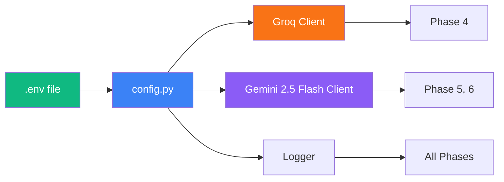

<div align="center">

# ⚙️ Phase 1 — Setup & Configuration

**The foundation layer: environment variables, LLM clients, and logging**

[]()
[]()
[]()

</div>

---

## 🧠 Problem → Solution → Impact

| | |
|---|---|
| **❌ Problem** | API keys scattered across files, no structured logging, duplicated client initialisation |
| **✅ Solution** | Centralised config loader, shared LLM client wrappers, structured coloured logging |
| **📈 Impact** | Single source of truth for all settings — one `.env` file controls everything |

---

## 📋 What This Phase Does



---

## 📥 Inputs

| Input | Source |
|-------|--------|
| `.env` file | Developer-created from `.env.example` |

## 📤 Outputs

| Output | Type | Used By |
|--------|------|---------| 
| `settings` object | Python module | All phases |
| `groq_client` | Groq API client | Phase 4 |
| `gemini_client` | Gemini API client | Phase 5, 6 |
| `get_logger()` | Logger factory | All phases |

---

## 📁 Files

```
phase1_setup/
├── README.md           # This file
├── __init__.py         # Package exports (lazy LLM import)
├── config.py           # Env var loading & constants
├── llm_clients.py      # Groq + Gemini client wrappers
└── logger.py           # Structured coloured logging
```

---

## 🔐 Environment Variables

| Variable | Type | Required | Default |
|----------|------|----------|---------|
| `GROQ_API_KEY` | string | ✅ | — |
| `GEMINI_API_KEY` | string | ✅ | — |
| `EMAIL_ADDRESS` | string | ✅ | — |
| `EMAIL_APP_PASSWORD` | string | ✅ | — |
| `PORT` | int | ❌ | `8501` |

---

## ▶️ How to Run

```bash
# This phase is imported by other phases, not run directly.
# To verify config loads correctly:
python -c "from phase1_setup.config import settings; print(settings)"

# To run all Phase 1 tests:
python tests/test_phase1.py
```

---

## 📦 Dependencies

| Package | Purpose |
|---------|---------|
| `python-dotenv` | Load `.env` files |
| `groq` | Groq API client (LLaMA 3.3 70B) |
| `google-genai` | Google Gemini 2.5 Flash client |

---

## ✅ Success Criteria

- [x] All env vars load without error
- [x] Groq client initialises and responds (6/6 tests pass)
- [x] Gemini 2.5 Flash client initialises and generates text
- [x] Logger outputs structured coloured output to console
