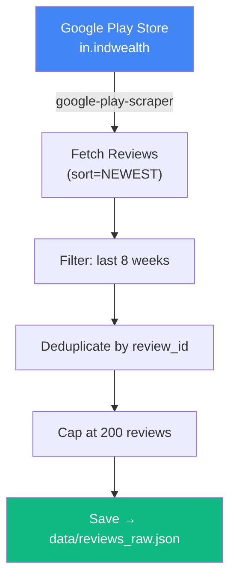

<div align="center">

# 📥 Phase 2 — Review Scraping

**Fetch and filter the latest INDMoney reviews from Google Play Store**

[]()
[]()
[]()
[]()

</div>

---

## 🧠 Problem → Solution → Impact

| | |
|---|---|
| **❌ Problem** | Manually browsing hundreds of Play Store reviews is time-consuming and unscalable |
| **✅ Solution** | Automated scraping with date filtering, deduplication, and a 200-review cap for cost control |
| **📈 Impact** | Fresh, structured review data ready for AI analysis in under 30 seconds |

---

## 📋 What This Phase Does



---

## 📥 Inputs

| Input | Value |
|-------|-------|
| App ID | `in.indwealth` |
| Play Store URL | https://play.google.com/store/apps/details?id=in.indwealth&hl=en_IN |
| Time window | Last **8 weeks** from current date |

## 📤 Outputs

| Output | Path | Format |
|--------|------|--------|
| Raw reviews | `data/reviews_raw.json` | JSON array |

### Data Schema

```json
{
  "review_id": "gp:AOqpTOH...",
  "rating": 4,
  "title": "Great app but slow",
  "text": "I love the features but the load time is frustrating...",
  "date": "2026-03-01",
  "thumbs_up": 12
}
```

---

## 📁 Files

```
phase2_scraper/
├── README.md           # This file
├── __init__.py         # Package exports
└── scraper.py          # Play Store scraping logic
```

---

## ▶️ How to Run

```bash
# Run Phase 2 independently
python -m phase2_scraper.scraper

# Or as part of the full pipeline
python main.py
```

---

## 📦 Dependencies

| Package | Purpose |
|---------|---------|
| `google-play-scraper` | Fetch reviews from Google Play |
| `python-dateutil` | Date parsing and 8-week filtering |

---

## ⚠️ Error Handling

| Scenario | Strategy |
|----------|----------|
| Play Store rate-limit | Exponential backoff, max 3 retries |
| Network timeout | Retry with increasing delay |
| Zero reviews returned | Log warning, create empty JSON array |
| Duplicate reviews | Deduplicate by `review_id` |

---

## ✅ Success Criteria

- [ ] 200 reviews (or all available within 8 weeks) scraped
- [ ] All reviews have valid `review_id`, `rating`, `text`, and `date`
- [ ] `data/reviews_raw.json` is valid JSON
- [ ] No reviews older than 8 weeks in output
