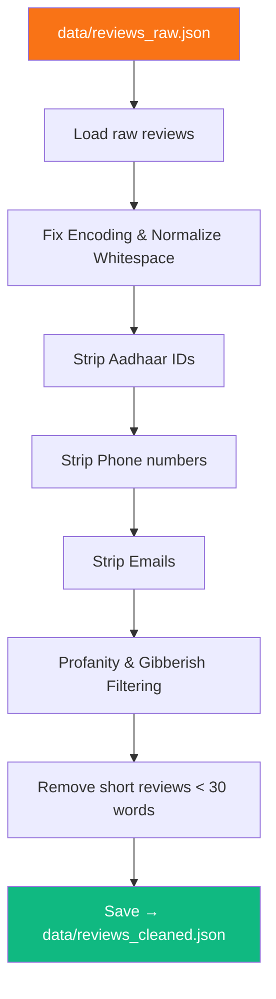

<div align="center">

# 🧹 Phase 3 — Data Cleaning & PII Removal

**Strip personal information, normalise text, and prepare reviews for AI processing**

[]()
[]()
[]()
[]()

</div>

---

## 🧠 Problem → Solution → Impact

| | |
|---|---|
| **❌ Problem** | Raw reviews contain emails, phone numbers, hate speech, and gibberish. This leads to privacy risks and token waste. |
| **✅ Solution** | Regex-based PII detection, simple heuristic filtering, lightweight profanity filtering, and text normalisation. |
| **📈 Impact** | Zero PII exposure to external APIs · Clean, consistent text for higher-quality AI analysis · Zero LLM token waste on bad data |

---

## 📋 What This Phase Does



---

## 📥 Inputs

| Input | Path | Format |
|-------|------|--------|
| Raw reviews | `data/reviews_raw.json` | JSON array |

## 📤 Outputs

| Output | Path | Format |
|--------|------|--------|
| Cleaned reviews | `data/reviews_cleaned.json` | JSON array |

### What Gets Stripped

| PII Type | Regex Pattern | Replacement |
|----------|--------------|-------------|
| Email addresses | `[\w.-]+@[\w.-]+\.\w+` | `[EMAIL]` |
| Phone numbers | `\+?\d[\d\s\-]{7,}\d` | `[PHONE]` |
| Aadhaar-like numbers | `\d{4}\s?\d{4}\s?\d{4}` | `[ID]` |

### What Gets Filtered

| Filter Type | Strategy |
|----------|--------------|
| Profanity | Dropped based on lightweight keyword matching. |
| Gibberish | Dropped if >50% nonsense words or >4 repeated characters. |
| Word count | Dropped if word count fals below 30 words after cleaning. |

---

## 📁 Files

```
phase3_cleaning/
├── README.md           # This file
├── __init__.py         # Package exports
└── cleaner.py          # PII removal, filtering, & text normalisation
```

---

## ▶️ How to Run

```bash
# Run Phase 3 independently (requires Phase 2 output)
python -m phase3_cleaning.cleaner

# Or as part of the full pipeline
python main.py
```

---

## 📦 Dependencies

| Package | Purpose |
|---------|---------|
| `re` (stdlib) | Regular expressions for PII detection and text filtering |
| `json` (stdlib) | JSON read/write |

> ✅ No external dependencies required — this phase uses only Python standard library.

---

## ⚠️ Error Handling

| Scenario | Strategy |
|----------|----------|
| Regex false positive | Aadhaar regex is checked before Phone numbers.  |
| Empty text after cleaning | Re-apply the 30 word minimum rule. |
| Missing input file | Raise clear error with instructions to run Phase 2 first |
| Encoding issues | Normalise to UTF-8; fix artefacts like `’` |

---

## ✅ Success Criteria

- [x] No email addresses remain in any review text
- [x] No phone numbers remain in any review text
- [x] No Aadhaar IDs remain in any review text
- [x] All reviews have at least 30 words of text
- [x] Gibberish and profanity reviews are dropped
- [x] `data/reviews_cleaned.json` is valid JSON
- [x] Detailed cleaning stats are logged correctly
