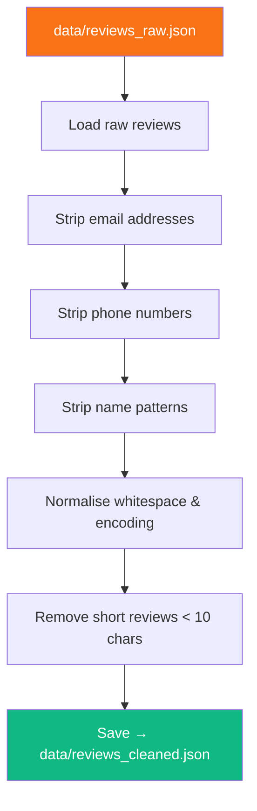

<div align="center">

# 🧹 Phase 3 — Data Cleaning & PII Removal

**Strip personal information, normalise text, and prepare reviews for AI processing**

[]()
[]()
[]()
[]()

</div>

---

## 🧠 Problem → Solution → Impact

| | |
|---|---|
| **❌ Problem** | Raw reviews contain emails, phone numbers, and names — sending these to an LLM is a privacy risk |
| **✅ Solution** | Regex-based PII detection and removal + text normalisation before any AI processing |
| **📈 Impact** | Zero PII exposure to external APIs · Clean, consistent text for higher-quality AI analysis |

---

## 📋 What This Phase Does



---

## 📥 Inputs

| Input | Path | Format |
|-------|------|--------|
| Raw reviews | `data/reviews_raw.json` | JSON array |

## 📤 Outputs

| Output | Path | Format |
|--------|------|--------|
| Cleaned reviews | `data/reviews_cleaned.json` | JSON array |

### What Gets Stripped

| PII Type | Regex Pattern | Replacement |
|----------|--------------|-------------|
| Email addresses | `[\w.-]+@[\w.-]+\.\w+` | `[EMAIL]` |
| Phone numbers | `\+?\d[\d\s\-]{7,}\d` | `[PHONE]` |
| Aadhaar-like numbers | `\d{4}\s?\d{4}\s?\d{4}` | `[ID]` |

---

## 📁 Files

```
phase3_cleaning/
├── README.md           # This file
├── __init__.py         # Package exports
└── cleaner.py          # PII removal & text normalisation
```

---

## ▶️ How to Run

```bash
# Run Phase 3 independently (requires Phase 2 output)
python -m phase3_cleaning.cleaner

# Or as part of the full pipeline
python main.py
```

---

## 📦 Dependencies

| Package | Purpose |
|---------|---------|
| `re` (stdlib) | Regular expressions for PII detection |
| `json` (stdlib) | JSON read/write |

> ✅ No external dependencies required — this phase uses only Python standard library.

---

## ⚠️ Error Handling

| Scenario | Strategy |
|----------|----------|
| Regex false positive | Use conservative patterns; prefer under-removal over over-removal |
| Empty text after cleaning | Remove the review from the dataset |
| Missing input file | Raise clear error with instructions to run Phase 2 first |
| Encoding issues | Normalise to UTF-8; strip non-printable characters |

---

## ✅ Success Criteria

- [ ] No email addresses remain in any review text
- [ ] No phone numbers remain in any review text
- [ ] All reviews have at least 10 characters of text
- [ ] `data/reviews_cleaned.json` is valid JSON
- [ ] Review count logged: `"Cleaned X reviews, removed Y short/empty"` 
