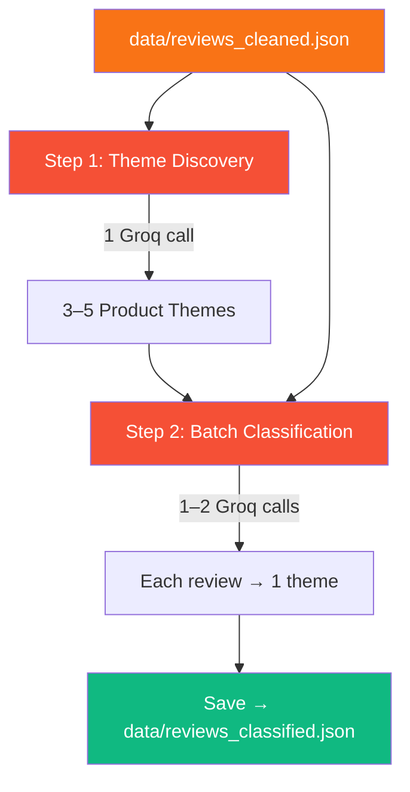

<div align="center">

# 🏷️ Phase 4 — Theme Generation & Classification

**Discover recurring product themes and classify every review using Groq LLaMA 3**

[]()
[]()
[]()
[]()

</div>

---

## 🧠 Problem → Solution → Impact

| | |
|---|---|
| **❌ Problem** | 200 individual reviews are too noisy — leadership can't see the patterns |
| **✅ Solution** | LLM-powered theme discovery (3–5 themes) + batch classification in just 2–3 API calls |
| **📈 Impact** | Every review tagged with a product theme · Token-efficient design keeps costs near-zero |

---

## 📋 What This Phase Does



---

## 📥 Inputs

| Input | Path | Format |
|-------|------|--------|
| Cleaned reviews | `data/reviews_cleaned.json` | JSON array |

## 📤 Outputs

| Output | Path | Format |
|--------|------|--------|
| Classified reviews | `data/reviews_classified.json` | JSON array (with `theme` field added) |

### Output Schema

```json
{
  "review_id": "gp:AOqpTOH...",
  "rating": 2,
  "title": "App keeps crashing",
  "text": "Every time I open the portfolio section...",
  "date": "2026-03-05",
  "thumbs_up": 8,
  "theme": "App Performance"
}
```

---

## 🤖 LLM Strategy — Why Groq?

| Attribute | Groq | Alternative |
|-----------|------|-------------|
| **Speed** | ~500 tokens/sec | ~100 tokens/sec |
| **Cost** | Very low | Moderate |
| **Task fit** | Classification ✅ | Overkill |
| **Model** | LLaMA 3 70B | — |

### Token Optimization

| Strategy | Savings |
|----------|---------|
| Generate themes **once**, reuse for classification | Avoids N redundant discovery calls |
| Batch classification (all reviews in 1–2 calls) | Reduces per-review overhead |
| Structured JSON output format | Smaller response tokens |

### Estimated Token Usage

| Step | Input | Output |
|------|------:|-------:|
| Theme discovery | ~8,000 | ~200 |
| Batch classification | ~10,000 | ~2,000 |
| **Total** | **~18,000** | **~2,200** |

---

## 📁 Files

```
phase4_themes/
├── README.md              # This file
├── __init__.py            # Package exports
└── theme_generator.py     # Theme discovery + classification
```

---

## ▶️ How to Run

```bash
# Run Phase 4 independently (requires Phase 3 output)
python -m phase4_themes.theme_generator

# Or as part of the full pipeline
python main.py
```

---

## 📦 Dependencies

| Package | Purpose |
|---------|---------|
| `groq` | Groq API client for LLaMA 3 inference |

## 🔐 Environment Variables

| Variable | Required |
|----------|----------|
| `GROQ_API_KEY` | ✅ |

---

## ⚠️ Error Handling

| Scenario | Strategy |
|----------|----------|
| Groq API timeout | Retry once with smaller batch |
| Rate limit hit | Wait and retry with backoff |
| Malformed LLM JSON | Attempt partial parse; tag failures as "Uncategorised" |
| Theme count < 3 or > 5 | Re-prompt with stricter constraints |

---

## ✅ Success Criteria

- [ ] 3–5 product-related themes generated
- [ ] Every review has a valid `theme` field
- [ ] No "Uncategorised" reviews (or < 5% if edge cases exist)
- [ ] Total Groq API calls ≤ 3
- [ ] `data/reviews_classified.json` is valid JSON
