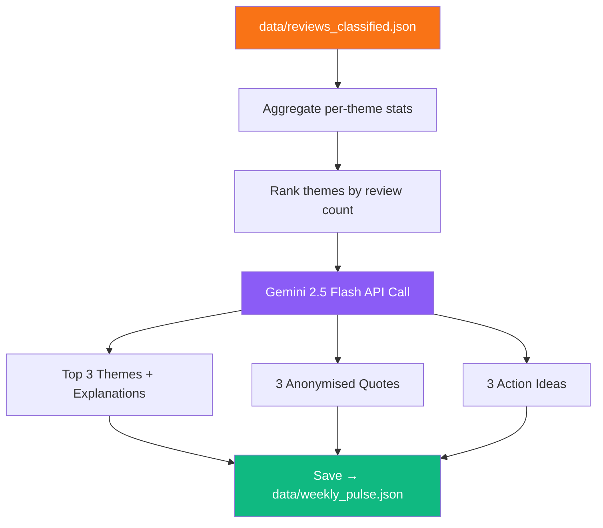

<div align="center">

# 📊 Phase 5 — Weekly Pulse Generation

**Transform classified reviews into a leadership-ready product insight summary using Gemini 2.5 Flash**

[]()
[]()
[]()
[]()

</div>

---

## 🧠 Problem → Solution → Impact

| | |
|---|---|
| **❌ Problem** | Classified reviews are useful for engineers, but leadership needs a 60-second executive summary |
| **✅ Solution** | Gemini 2.5 Flash generates a structured pulse: top 3 themes, real quotes, and actionable product ideas — in a single API call |
| **📈 Impact** | Leadership gets a data-driven "pulse check" they can read in under a minute |

---

## 📋 What This Phase Does



---

## 📥 Inputs

| Input | Path | Format |
|-------|------|--------|
| Classified reviews | `data/reviews_classified.json` | JSON array |

## 📤 Outputs

| Output | Path | Format |
|--------|------|--------|
| Weekly pulse | `data/weekly_pulse.json` | Structured JSON |

### Output Schema

```json
{
  "generated_at": "2026-03-13T16:30:00",
  "week_range": "Mar 06 – Mar 13, 2026",
  "total_reviews": 187,
  "top_themes": [
    {
      "rank": 1,
      "name": "App Performance",
      "review_count": 47,
      "avg_rating": 2.3,
      "explanation": "Users report frequent crashes during portfolio loading..."
    },
    {
      "rank": 2,
      "name": "Investment Features",
      "review_count": 38,
      "avg_rating": 3.8,
      "explanation": "Positive reception for SIP tracking, but users want..."
    },
    {
      "rank": 3,
      "name": "Customer Support",
      "review_count": 32,
      "avg_rating": 2.1,
      "explanation": "Users report 3–5 day response times for support tickets..."
    }
  ],
  "user_quotes": [
    {
      "quote": "The app freezes every time I try to check my portfolio...",
      "theme": "App Performance",
      "rating": 2
    }
  ],
  "action_ideas": [
    {
      "title": "Optimise cold-start latency",
      "rationale": "47 reviews mention slow loading after app install..."
    }
  ]
}
```

---

## 🤖 LLM Strategy — Why Gemini 2.5 Flash?

| Attribute | Gemini 2.5 Flash | Alternative |
|-----------|--------|-------------|
| **Summary quality** | Excellent ✅ | Good |
| **Structured JSON** | Native support | Needs coercion |
| **Language polish** | Leadership-grade ✅ | Casual |
| **Reasoning** | Strong (thinking model) ✅ | Basic |
| **Speed** | Fast (flash variant) ✅ | Slower |
| **Model** | `gemini-2.5-flash-preview-04-17` | — |

### Estimated Token Usage

| Step | Input | Output |
|------|------:|-------:|
| Pulse generation | ~6,000 | ~1,500 |

> **Single API call** — the entire pulse is generated in one shot for cost efficiency.

---

## 📁 Files

```
phase5_pulse/
├── README.md              # This file
├── __init__.py            # Package exports
└── pulse_generator.py     # Gemini-powered pulse generation
```

---

## ▶️ How to Run

```bash
# Run Phase 5 independently (requires Phase 4 output)
python -m phase5_pulse.pulse_generator

# Or as part of the full pipeline
python main.py
```

---

## 📦 Dependencies

| Package | Purpose |
|---------|---------|
| `google-genai` | Google Gemini API client |

## 🔐 Environment Variables

| Variable | Required |
|----------|----------|
| `GEMINI_API_KEY` | ✅ |

---

## 🔒 Privacy Guarantees

- All quotes are **anonymised** — no usernames, names, or identifiers
- PII was already stripped in Phase 3; verified again before quote selection
- No raw review IDs appear in pulse output

---

## ⚠️ Error Handling

| Scenario | Strategy |
|----------|----------|
| Gemini API error | Retry once; save partial output if available |
| Invalid JSON response | Attempt partial parse; log raw response for debugging |
| Missing themes | Fallback to aggregation-based summary (no LLM) |

---

## ✅ Success Criteria

- [ ] Pulse contains exactly 3 top themes with explanations
- [ ] Pulse contains exactly 3 anonymised user quotes
- [ ] Pulse contains exactly 3 action ideas with rationale
- [ ] Zero PII in any quote or explanation
- [ ] `data/weekly_pulse.json` validates against schema
- [ ] Total Gemini calls = 1
