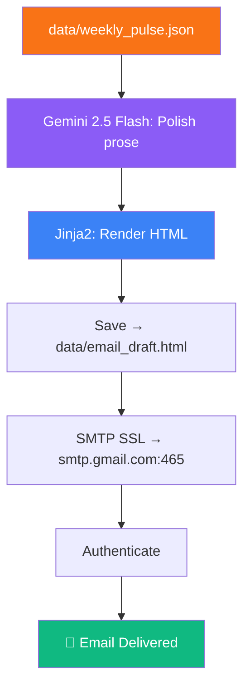

<div align="center">

# 📧 Phase 6 — Email Draft & Delivery

**Format the pulse as a professional HTML email and deliver via Gmail SMTP**

[]()
[]()
[]()
[]()
[]()

</div>

---

## 🧠 Problem → Solution → Impact

| | |
|---|---|
| **❌ Problem** | A JSON file sitting on disk doesn't reach stakeholders — the insight dies unread |
| **✅ Solution** | Gemini 2.5 Flash polishes the pulse into professional prose, Jinja2 renders a clean HTML email, Gmail delivers it |
| **📈 Impact** | Leadership gets a scannable email in their inbox every week — zero effort required from anyone |

---

## 📋 What This Phase Does



---

## 📥 Inputs

| Input | Path | Format |
|-------|------|--------|
| Weekly pulse data | `data/weekly_pulse.json` | Structured JSON |
| Email template | `phase6_email/templates/email_template.html` | Jinja2 HTML |

## 📤 Outputs

| Output | Path / Channel | Format |
|--------|---------------|--------|
| Email draft | `data/email_draft.html` | HTML file |
| Delivered email | Developer's Gmail inbox | HTML email |

### Email Structure

```
📧 Subject: 📊 INDMoney Weekly User Pulse — {week_range}

┌──────────────────────────────────────────────────┐
│                                                  │
│  Hi Team,                                        │
│                                                  │
│  Here's your weekly user sentiment pulse         │
│  based on {total} Play Store reviews.            │
│                                                  │
│  ── TOP THEMES ─────────────────────────         │
│  1. {Theme 1} ({count} reviews, ★{avg})          │
│     {explanation}                                │
│                                                  │
│  2. {Theme 2} ...                                │
│  3. {Theme 3} ...                                │
│                                                  │
│  ── WHAT USERS ARE SAYING ──────────────         │
│  💬 "{quote 1}" (★{rating})                      │
│  💬 "{quote 2}" (★{rating})                      │
│  💬 "{quote 3}" (★{rating})                      │
│                                                  │
│  ── SUGGESTED ACTIONS ──────────────────         │
│  → {Action 1}                                    │
│  → {Action 2}                                    │
│  → {Action 3}                                    │
│                                                  │
│  Best,                                           │
│  Weekly Pulse Bot                                │
│                                                  │
└──────────────────────────────────────────────────┘
```

---

## 📁 Files

```
phase6_email/
├── README.md              # This file
├── __init__.py            # Package exports
├── email_sender.py        # Draft generation + SMTP delivery
└── templates/
    └── email_template.html  # Jinja2 HTML template
```

---

## ▶️ How to Run

```bash
# Run Phase 6 independently (requires Phase 5 output)
python -m phase6_email.email_sender

# Or as part of the full pipeline
python main.py
```

---

## 📦 Dependencies

| Package | Purpose |
|---------|---------|
| `google-genai` | Gemini 2.5 Flash for prose polishing |
| `Jinja2` | HTML template rendering |
| `smtplib` (stdlib) | SMTP email sending |
| `email.mime` (stdlib) | Email message construction |

## 🔐 Environment Variables

| Variable | Required | Description |
|----------|----------|-------------|
| `GEMINI_API_KEY` | ✅ | For prose polishing |
| `EMAIL_ADDRESS` | ✅ | Sender & recipient Gmail address |
| `EMAIL_APP_PASSWORD` | ✅ | Gmail App Password (not main password) |

---

## 🔧 Gmail Setup Guide

1. **Enable 2-Step Verification**
   - Go to [Google Account → Security](https://myaccount.google.com/security)
   - Turn on 2-Step Verification

2. **Generate App Password**
   - Go to [App Passwords](https://myaccount.google.com/apppasswords)
   - Select "Mail" → Generate
   - Copy the 16-character password

3. **Store Credentials**
   ```bash
   # In your .env file
   EMAIL_ADDRESS=your-email@gmail.com
   EMAIL_APP_PASSWORD=abcd efgh ijkl mnop
   ```

> ⚠️ **Never** use your main Gmail password. Always use an App Password.

---

## ⚠️ Error Handling

| Scenario | Strategy |
|----------|----------|
| SMTP authentication failure | Log error; save draft locally |
| Gemini API error → fallback to raw pulse data (no polish) |
| Template rendering error | Log and raise; do not send incomplete email |
| Network timeout | Retry SMTP connection once |

---

## ✅ Success Criteria

- [ ] HTML email draft saved to `data/email_draft.html`
- [ ] Email delivered to developer's inbox
- [ ] Email contains all 3 sections (themes, quotes, actions)
- [ ] Email renders correctly in Gmail web client
- [ ] No PII in any section of the email
