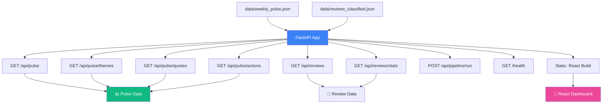

<div align="center">

# 🖥️ Phase 7 — Backend API

**FastAPI-powered REST API serving pulse data to the dashboard and external consumers**

[]()
[]()
[]()
[]()

</div>

---

## 🧠 Problem → Solution → Impact

| | |
|---|---|
| **❌ Problem** | Pipeline output is a set of JSON files on disk — not accessible from a browser, not shareable with the team, not inspectable without SSH |
| **✅ Solution** | A FastAPI backend that reads pipeline outputs and exposes them as clean REST endpoints, plus serves the frontend dashboard as static files |
| **📈 Impact** | Anyone with the URL can view the pulse dashboard · No file access needed · API-first design enables future integrations (Slack bots, Notion, etc.) |

---

## 📋 What This Phase Does



---

## 📥 Inputs

| Input | Path | Format |
|-------|------|--------|
| Weekly pulse | `data/weekly_pulse.json` | Structured JSON |
| Classified reviews | `data/reviews_classified.json` | JSON array |
| Frontend files | `phase8_frontend/dist/` | React build

## 📤 Outputs

| Output | Type | Description |
|--------|------|-------------|
| REST API | HTTP JSON | All endpoints return JSON responses |
| Swagger docs | HTML | Auto-generated at `/docs` |
| Static files | React build | Frontend dashboard served at `/` |

---

## 🛣️ API Endpoints

### Pulse Endpoints

| Method | Path | Description | Response |
|--------|------|-------------|----------|
| `GET` | `/api/pulse` | Full weekly pulse (themes + quotes + actions) | `weekly_pulse.json` contents |
| `GET` | `/api/pulse/themes` | Top 3 themes with explanations and stats | Array of theme objects |
| `GET` | `/api/pulse/quotes` | 3 anonymised user quotes | Array of quote objects |
| `GET` | `/api/pulse/actions` | 3 suggested product actions | Array of action objects |

### Review Endpoints

| Method | Path | Description | Response |
|--------|------|-------------|----------|
| `GET` | `/api/reviews` | All classified reviews (paginated) | `{ reviews, total, page }` |
| `GET` | `/api/reviews/stats` | Rating distribution, total count, average | `{ distribution, total, avg }` |

### System Endpoints

| Method | Path | Description | Response |
|--------|------|-------------|----------|
| `GET` | `/health` | Health check for monitoring | `{ status: "ok" }` |
| `POST` | `/api/pipeline/run` | Trigger the pipeline manually | `{ status: "started" }` |

---

## 📁 Files

```
phase7_backend/
├── README.md           # This file
├── __init__.py         # Package exports
├── app.py              # FastAPI application setup + static file serving
└── routes.py           # API route handlers
```

---

## ▶️ How to Run

```bash
# Run the backend server
uvicorn phase7_backend.app:app --host 0.0.0.0 --port 8000 --reload

# Then open:
#   Dashboard:  http://localhost:8000
#   API Docs:   http://localhost:8000/docs
#   Health:     http://localhost:8000/health
```

---

## 📦 Dependencies

| Package | Purpose |
|---------|---------|
| `fastapi` | Web framework |
| `uvicorn` | ASGI server |

## 🔐 Environment Variables

| Variable | Required | Description |
|----------|----------|-------------|
| `PORT` | ❌ | Server port (default: 8000) |

---

## 🔧 CORS Configuration

```python
# Allowed origins
origins = [
    "http://localhost:5173",     # Vite React dev server
    "http://localhost:8000",     # Production (served by FastAPI)
    "https://your-deployed-url.com"
]
```

---

## 📊 Example API Responses

### `GET /api/pulse/themes`
```json
[
  {
    "rank": 1,
    "name": "App Performance",
    "review_count": 47,
    "avg_rating": 2.3,
    "explanation": "Users report frequent crashes..."
  }
]
```

### `GET /api/reviews/stats`
```json
{
  "total_reviews": 187,
  "avg_rating": 3.2,
  "rating_distribution": {
    "1": 61, "2": 52, "3": 18, "4": 24, "5": 32
  }
}
```

---

## ⚠️ Error Handling

| Scenario | Strategy |
|----------|----------|
| Data file not found | Return `503` with `"Pipeline has not run yet"` |
| Invalid JSON in data file | Return `500` with error details |
| Pipeline trigger fails | Return `500` with traceback summary |
| Unexpected exception | FastAPI exception handler returns clean JSON error |

---

## ✅ Success Criteria

- [ ] All 8 endpoints return valid JSON
- [ ] Swagger docs accessible at `/docs`
- [ ] Frontend React build served as static files at `/`
- [ ] CORS allows Vite dev server origin (localhost:5173)
- [ ] Health check returns `200 OK`
- [ ] Pipeline trigger endpoint invokes `main.py`
