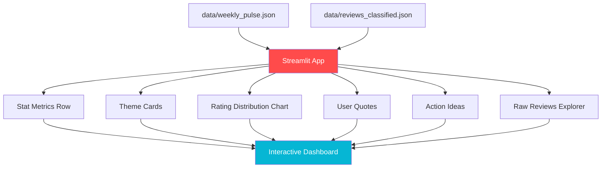

<div align="center">

# 📊 Phase 7 — Streamlit Dashboard

**An interactive, dark-mode Streamlit dashboard that visualises the weekly pulse in real time**

[]()
[]()
[]()
[]()
[]()

</div>

---

## 🧠 Problem → Solution → Impact

| | |
|---|---|
| **❌ Problem** | The weekly pulse is an email or JSON file — not interactive, not explorable, not visually impressive for a portfolio |
| **✅ Solution** | A Streamlit dashboard that reads pipeline JSON outputs directly, renders interactive charts and cards, and deploys free on Streamlit Cloud |
| **📈 Impact** | Portfolio-grade visual proof of the project · Leadership can bookmark and revisit · No separate backend needed — Streamlit does it all |

---

## 📋 What This Phase Does



---

## 📥 Inputs

| Input | Path | Format |
|-------|------|--------|
| Weekly pulse | `data/weekly_pulse.json` | Structured JSON |
| Classified reviews | `data/reviews_classified.json` | JSON array |

## 📤 Outputs

| Output | Channel | Description |
|--------|---------|-------------|
| Dashboard | Browser at `http://localhost:8501` | Interactive Streamlit app |
| Deployed | Streamlit Cloud URL | Free public deployment |

---

## 🎨 Dashboard Layout

```
┌──────────────────────────────────────────────────────────────┐
│  📊 INDMoney Weekly Pulse Dashboard                          │
│  Week of Mar 13 – Mar 18, 2026                               │
├──────────────────────────────────────────────────────────────┤
│                                                              │
│  ┌────────────┐ ┌────────────┐ ┌────────────┐ ┌────────────┐│
│  │  📝 187    │ │  ⭐ 3.2    │ │  🏷️ 5      │ │  📧 Sent   ││
│  │  Reviews   │ │  Avg Rating│ │  Themes    │ │  Email OK  ││
│  │  (metric)  │ │  (metric)  │ │  (metric)  │ │  (metric)  ││
│  └────────────┘ └────────────┘ └────────────┘ └────────────┘│
│                                                              │
│  ── 🏷️ Top Themes ──────────────────────────────────────    │
│  [Expandable cards with st.expander()]                       │
│  ┌──────────────────────┐  ┌──────────────────────┐         │
│  │ 🔴 App Performance   │  │ 🟡 Investment Feat.  │         │
│  │ 47 reviews · ★2.3    │  │ 38 reviews · ★3.8    │         │
│  │ Crashes, slow load    │  │ SIP tracking, MF...  │         │
│  └──────────────────────┘  └──────────────────────┘         │
│                                                              │
│  ── 📊 Rating Distribution ─────────────────────────────    │
│  [st.bar_chart() or Plotly horizontal bar chart]             │
│  ★5  ████████████████████████  32  (17%)                     │
│  ★4  ████████████████  24  (13%)                             │
│  ★3  ████████████  18  (10%)                                 │
│  ★2  ████████████████████████████████  52  (28%)             │
│  ★1  ██████████████████████████████████████████  61  (33%)   │
│                                                              │
│  ── 💬 What Users Are Saying ───────────────────────────    │
│  [st.info() styled quote blocks]                             │
│  "The app freezes every time I try to..." (★2)               │
│  "Love the SIP tracker!" (★4)                                │
│                                                              │
│  ── 🎯 Recommended Actions ────────────────────────────    │
│  [st.success() styled action cards]                          │
│  → Optimise cold-start latency                               │
│  → Add mutual fund comparison feature                        │
│  → Implement SLA-based ticket escalation                     │
│                                                              │
│  ── 📋 Review Explorer (Sidebar) ──────────────────────    │
│  [Filter by theme, rating — st.dataframe()]                  │
│                                                              │
│  ── Footer ─────────────────────────────────────────────    │
│  Generated at 2026-03-18 · Powered by Groq + Gemini         │
└──────────────────────────────────────────────────────────────┘
```

---

## 🏗️ Streamlit Advantages over FastAPI + React

| Aspect | FastAPI + React | Streamlit |
|--------|----------------|-----------|
| **Files to maintain** | ~15+ files across 2 folders | **1 Python file** |
| **Build step needed** | Yes (npm run build) | **No** |
| **Separate backend** | Yes (FastAPI server) | **No** (reads JSON directly) |
| **Deployment** | Docker + hosting | **Streamlit Cloud (free)** |
| **Learning curve** | React + Python | **Python only** |
| **Interactive charts** | Custom JS/Recharts | **Built-in + Plotly** |
| **Data tables** | Custom components | **st.dataframe()** |

---

## 📁 Files

```
phase7_dashboard/
├── README.md               # This file
├── __init__.py              # Package marker
└── app.py                   # Streamlit dashboard application
```

---

## ▶️ How to Run

### Local Development

```bash
streamlit run phase7_dashboard/app.py
# Opens at http://localhost:8501
```

### Deploy on Streamlit Cloud

1. Push repo to GitHub
2. Go to [share.streamlit.io](https://share.streamlit.io)
3. Select your repo → `phase7_dashboard/app.py`
4. Add secrets in Streamlit Cloud dashboard:
   - `GROQ_API_KEY`
   - `GEMINI_API_KEY`
   - `EMAIL_ADDRESS`
   - `EMAIL_APP_PASSWORD`
5. Deploy!

---

## 📦 Dependencies

| Package | Purpose |
|---------|---------|
| `streamlit` | Dashboard framework |
| `plotly` | Interactive charts (rating distribution) |
| `pandas` | Data manipulation for tables and charts |

---

## 🎨 Streamlit UI Components Used

| Streamlit Component | Dashboard Element |
|---------------------|-------------------|
| `st.metric()` | Stat cards (reviews, rating, themes, email) |
| `st.columns()` | Side-by-side layout for cards |
| `st.expander()` | Collapsible theme detail cards |
| `plotly.express.bar()` | Rating distribution chart |
| `st.info()` / `st.warning()` | Styled user quote blocks |
| `st.success()` | Action idea cards |
| `st.dataframe()` | Interactive review explorer table |
| `st.sidebar` | Filters (theme, rating range) |
| `st.set_page_config()` | Dark mode, page title, favicon |

---

## 🎨 Theming

```toml
# .streamlit/config.toml
[theme]
primaryColor = "#8B5CF6"
backgroundColor = "#0f0f23"
secondaryBackgroundColor = "#1a1a3e"
textColor = "#e0e0e0"
font = "sans serif"
```

---

## ⚠️ Error Handling

| Scenario | Strategy |
|----------|----------|
| JSON files not found | Show "Run the pipeline first" with `st.warning()` |
| Empty pulse data | Show "No data available" info message |
| Malformed JSON | `st.error()` with parse error details |
| Streamlit Cloud deploy fails | Check secrets configuration |

---

## ✅ Success Criteria

- [ ] `streamlit run phase7_dashboard/app.py` starts without errors
- [ ] Dashboard loads at `http://localhost:8501`
- [ ] 4 stat metrics display correct numbers
- [ ] Theme cards show top 3 themes with explanations
- [ ] Rating distribution chart renders with Plotly
- [ ] User quotes display in styled blocks
- [ ] Action ideas listed with rationale
- [ ] Sidebar filter works (filter by theme/rating)
- [ ] Review explorer shows paginated data
- [ ] Dark theme looks premium
- [ ] Deployable on Streamlit Cloud
