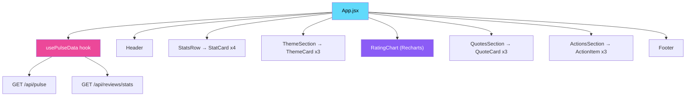

<div align="center">

# 🎨 Phase 8 — Frontend Dashboard (React)

**A premium, dark-mode React dashboard that visualises the weekly pulse in real time**

[]()
[]()
[]()
[]()
[]()

</div>

---

## 🧠 Problem → Solution → Impact

| | |
|---|---|
| **❌ Problem** | The weekly pulse is an email or JSON file — not interactive, not explorable, not visually impressive for a portfolio |
| **✅ Solution** | A stunning React dashboard with dark-mode glassmorphism, Recharts visualisations, and real-time API data — built with Vite for instant HMR |
| **📈 Impact** | Portfolio-grade visual proof of the project · Leadership can bookmark and revisit anytime · Demonstrates full-stack React capability |

---

## 📋 What This Phase Does



---

## 📥 Inputs

| Input | Source | Format |
|-------|--------|--------|
| Pulse data | `GET /api/pulse` (Phase 7 backend) | JSON |
| Review stats | `GET /api/reviews/stats` (Phase 7 backend) | JSON |

## 📤 Outputs

| Output | Channel | Description |
|--------|---------|-------------|
| Dashboard | Browser at `http://localhost:5173` (dev) | Interactive, responsive React SPA |
| Production build | `phase8_frontend/dist/` | Static files served by backend |

---

## ⚛️ React Component Architecture

```
<App />
├── <Header />              # Title, week range, refresh button
├── <StatsRow />             # 4 metric cards in a responsive grid
│   └── <StatCard />         # Reusable: icon, value, label
├── <ThemeSection />         # Top 3 theme cards
│   └── <ThemeCard />        # Glassmorphism card with theme details
├── <RatingChart />          # Horizontal bar chart (Recharts)
├── <QuotesSection />        # User quote showcase
│   └── <QuoteCard />        # Styled quote with star rating
├── <ActionsSection />       # Recommended product actions
│   └── <ActionItem />       # Individual action with rationale
└── <Footer />               # Generation timestamp, Groq + Gemini credits
```

### Custom Hook

```jsx
// hooks/usePulseData.js
const { pulse, stats, loading, error, refresh } = usePulseData();
```

- Fetches `/api/pulse` and `/api/reviews/stats` on mount
- Returns `loading`, `error`, and `refresh` function
- Auto-refreshes on `refresh()` call

---

## 🎨 Design System

| Property | Value |
|----------|-------|
| **Background** | Dark gradient (`#0f0f23` → `#1a1a3e`) |
| **Cards** | Glassmorphism (`backdrop-filter: blur(16px)`, semi-transparent) |
| **Accent colours** | `#8B5CF6` (purple), `#06B6D4` (cyan), `#F97316` (orange) |
| **Typography** | Inter (Google Fonts) — clean, modern |
| **Animations** | Fade-in on load, hover scale on cards, smooth transitions |
| **Charts** | Recharts — horizontal bars with gradient fills |
| **Responsive** | CSS Grid + Flexbox — mobile-first design |

---

## 📁 Files

```
phase8_frontend/
├── README.md               # This file
├── index.html              # Vite entry HTML
├── vite.config.js          # Vite config + backend proxy
├── package.json            # React + Recharts dependencies
├── src/
│   ├── main.jsx            # React entry point
│   ├── App.jsx             # Root component
│   ├── App.css             # Global dark-mode styles
│   ├── components/
│   │   ├── Header.jsx
│   │   ├── StatsRow.jsx
│   │   ├── StatCard.jsx
│   │   ├── ThemeSection.jsx
│   │   ├── ThemeCard.jsx
│   │   ├── RatingChart.jsx
│   │   ├── QuotesSection.jsx
│   │   ├── QuoteCard.jsx
│   │   ├── ActionsSection.jsx
│   │   └── ActionItem.jsx
│   ├── hooks/
│   │   └── usePulseData.js
│   └── utils/
│       └── api.js
└── dist/                   # Production build (gitignored)
```

---

## ▶️ How to Run

### Development (with hot reload)

```bash
cd phase8_frontend
npm install
npm run dev
# Opens at http://localhost:5173
# Proxies API calls to http://localhost:8000
```

### Production Build

```bash
cd phase8_frontend
npm run build
# Output: phase8_frontend/dist/
# Served by FastAPI backend at http://localhost:8000
```

> **Dev workflow:** Run backend (`uvicorn`) on port 8000 and frontend (`npm run dev`) on port 5173. Vite proxies `/api` calls to the backend.

---

## 📦 Dependencies

| Package | Purpose |
|---------|---------|
| `react` | UI framework |
| `react-dom` | DOM rendering |
| `recharts` | Rating distribution chart |
| `vite` | Build tool with HMR |
| `@vitejs/plugin-react` | React support for Vite |

### Vite Proxy Config

```js
// vite.config.js
export default defineConfig({
  plugins: [react()],
  server: {
    proxy: {
      '/api': 'http://localhost:8000',
      '/health': 'http://localhost:8000'
    }
  }
})
```

---

## 📱 Responsive Breakpoints

| Breakpoint | Layout |
|------------|--------|
| `> 1024px` | 4 stat cards in row, 2-column theme cards |
| `768px – 1024px` | 2 stat cards per row, single-column themes |
| `< 768px` | Single column, stacked cards |

---

## ⚠️ Error Handling

| Scenario | Strategy |
|----------|----------|
| API unreachable | Show "Unable to load data — is the backend running?" |
| Empty pulse data | Show "No pulse data yet — run the pipeline first" |
| Slow API response | Show loading skeleton components |
| Component error | React Error Boundary with fallback UI |

---

## ✅ Success Criteria

- [ ] `npm run dev` starts without errors
- [ ] Dashboard loads at `http://localhost:5173`
- [ ] All 4 stat cards display correct numbers
- [ ] Theme cards show top 3 themes with explanations
- [ ] Recharts rating distribution chart renders accurately
- [ ] User quotes display with star ratings
- [ ] Action ideas listed with rationale
- [ ] Responsive on mobile (< 768px)
- [ ] Dark mode + glassmorphism — no "plain" feel
- [ ] Refresh button fetches fresh data without full page reload
- [ ] Production build works when served by FastAPI
