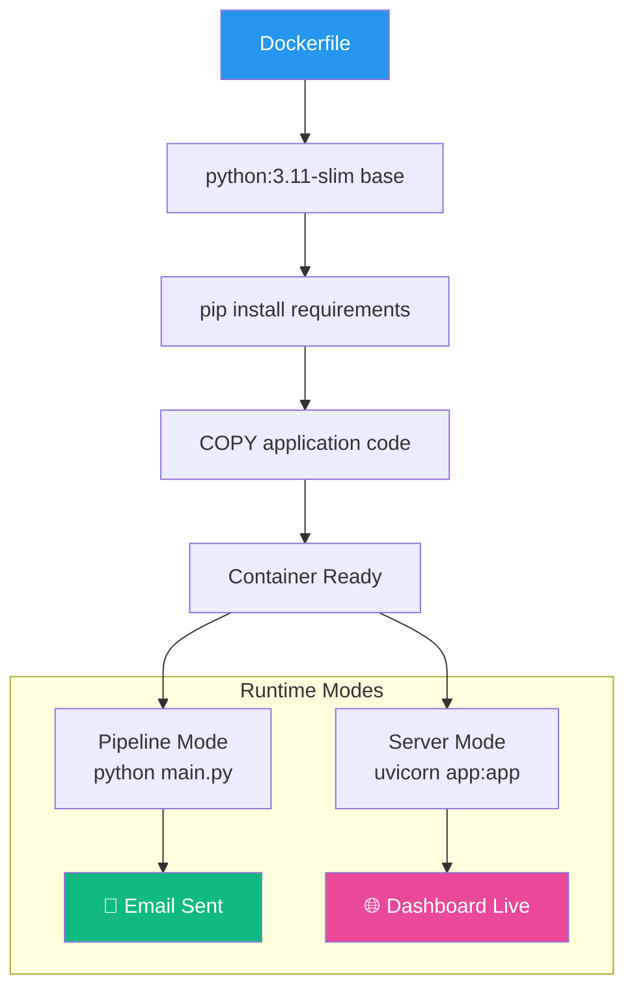

<div align="center">

# 🐳 Phase 9 — Docker Containerisation

**Package the entire platform (pipeline + backend + frontend) into a portable Docker container**

[]()
[]()
[]()
[]()

</div>

---

## 🧠 Problem → Solution → Impact

| | |
|---|---|
| **❌ Problem** | "Works on my machine" — Python version mismatches, missing packages, OS-specific issues make deployment painful |
| **✅ Solution** | A single Dockerfile builds a self-contained image with all dependencies, pipeline code, backend API, and frontend dashboard |
| **📈 Impact** | Run anywhere (laptop, server, CI/CD, cloud) with one command: `docker run --env-file .env weekly-pulse` |

---

## 📋 What This Phase Does



---

## 📁 Files

```
phase9_docker/
└── README.md               # This file (instructions only)

# The actual Docker files live at the repo root:
├── Dockerfile               # Container definition
├── .dockerignore            # Build exclusions
└── .env.example             # Env var template
```

> The Dockerfile stays at the repo root per Docker convention. This folder contains documentation only.

---

## 🐳 Dockerfile

```dockerfile
FROM python:3.11-slim

WORKDIR /app

# Layer-cached dependency install
COPY requirements.txt .
RUN pip install --no-cache-dir -r requirements.txt

# Copy application code
COPY . .

# Create output directory
RUN mkdir -p /app/data

# Default port
ENV PORT=8000
EXPOSE ${PORT}

# Default: run pipeline then start server
CMD ["python", "main.py"]
```

---

## 📦 .dockerignore

```
.env
.git/
data/
*.md
architecture/
__pycache__/
*.pyc
venv/
.venv/
.vscode/
.idea/
phase9_docker/
phase10_scheduler/
```

---

## ▶️ How to Run

### Build the Image

```bash
docker build -t weekly-pulse .
```

### Run — Pipeline Mode (scrape → email)

```bash
docker run --env-file .env weekly-pulse
```

### Run — Server Mode (dashboard)

```bash
docker run --env-file .env -p 8000:8000 weekly-pulse \
  uvicorn phase7_backend.app:app --host 0.0.0.0 --port 8000
```

### Run — Full Platform (pipeline + server)

```bash
docker run --env-file .env -p 8000:8000 weekly-pulse \
  sh -c "python main.py && uvicorn phase7_backend.app:app --host 0.0.0.0 --port 8000"
```

### Mount Data Locally

```bash
docker run --env-file .env -v $(pwd)/data:/app/data weekly-pulse
```

---

## 🏗️ Image Size Optimization

| Strategy | Impact |
|----------|--------|
| `python:3.11-slim` base | ~120MB vs ~900MB for full Python |
| `--no-cache-dir` for pip | Saves ~50MB in pip caches |
| `.dockerignore` excludes docs, git, data | Minimal build context |
| No dev dependencies | Only production packages |

**Expected image size: ~250MB**

---

## ⚠️ Error Handling

| Scenario | Strategy |
|----------|----------|
| Build failure | Check `requirements.txt` syntax and network |
| Missing env vars | Pipeline fails fast with clear error on startup |
| Port conflict | Use `-p <other>:8000` to remap |
| Permission errors | Ensure `data/` is writable in container |

---

## ✅ Success Criteria

- [ ] `docker build` completes without errors
- [ ] Pipeline mode runs and sends email
- [ ] Server mode serves dashboard at port 8000
- [ ] Image size < 300MB
- [ ] No secrets baked into the image (verified with `docker history`)
