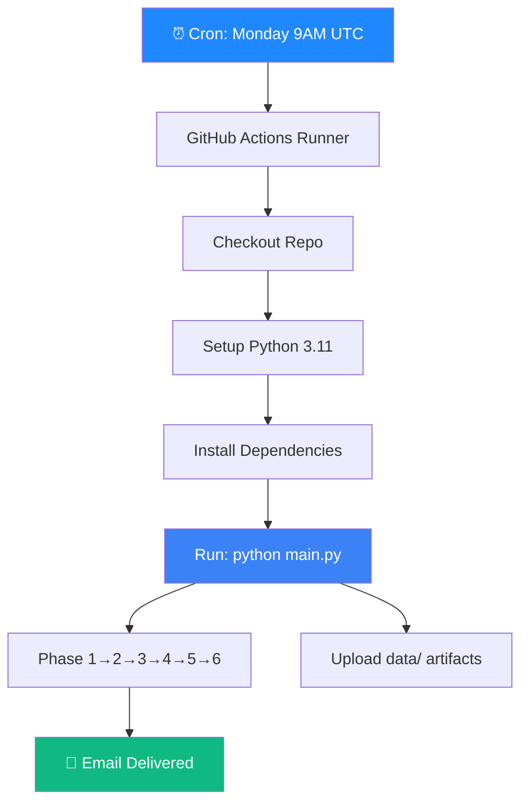

<div align="center">

# ⏰ Phase 9 — GitHub Actions Scheduler

**Automate the weekly pulse pipeline with a cron-based GitHub Actions workflow**

[]()
[]()
[]()
[]()

</div>

---

## 🧠 Problem → Solution → Impact

| | |
|---|---|
| **❌ Problem** | Someone has to remember to run `python main.py` every week — people forget, insights arrive late or not at all |
| **✅ Solution** | GitHub Actions cron trigger runs the full pipeline every Monday at 9 AM UTC — completely hands-off |
| **📈 Impact** | Guaranteed weekly delivery with zero human intervention · Free on GitHub · Full audit trail in Actions tab |

---

## 📋 What This Phase Does



---

## 📁 Files

```
phase9_scheduler/
└── README.md                           # This file (instructions)

# The actual workflow file:
.github/
└── workflows/
    └── weekly_pulse.yml                # Cron workflow definition
```

---

## 📄 Workflow Definition

```yaml
# .github/workflows/weekly_pulse.yml

name: 📊 Weekly Pulse Pipeline

on:
  # Automatic: Every Monday at 9:00 AM UTC
  schedule:
    - cron: '0 9 * * 1'

  # Manual: "Run workflow" button in GitHub UI
  workflow_dispatch:

jobs:
  run-pipeline:
    runs-on: ubuntu-latest
    timeout-minutes: 10

    steps:
      - name: 📥 Checkout repository
        uses: actions/checkout@v4

      - name: 🐍 Setup Python 3.11
        uses: actions/setup-python@v5
        with:
          python-version: '3.11'
          cache: 'pip'

      - name: 📦 Install dependencies
        run: pip install -r requirements.txt

      - name: 🚀 Run Weekly Pulse Pipeline
        env:
          GROQ_API_KEY: ${{ secrets.GROQ_API_KEY }}
          GEMINI_API_KEY: ${{ secrets.GEMINI_API_KEY }}
          EMAIL_ADDRESS: ${{ secrets.EMAIL_ADDRESS }}
          EMAIL_APP_PASSWORD: ${{ secrets.EMAIL_APP_PASSWORD }}
        run: python main.py

      - name: 📂 Upload pulse artifacts
        if: always()
        uses: actions/upload-artifact@v4
        with:
          name: weekly-pulse-${{ github.run_number }}
          path: data/
          retention-days: 30
```

---

## 🔐 Setting Up GitHub Secrets

1. Go to your repo → **Settings** → **Secrets and variables** → **Actions**
2. Click **New repository secret** for each:

| Secret Name | Value | Where to Get |
|-------------|-------|--------------|
| `GROQ_API_KEY` | Your Groq API key | [console.groq.com](https://console.groq.com) |
| `GEMINI_API_KEY` | Your Gemini API key | [ai.google.dev](https://ai.google.dev) |
| `EMAIL_ADDRESS` | Your Gmail address | Your Gmail |
| `EMAIL_APP_PASSWORD` | Gmail App Password | [myaccount.google.com/apppasswords](https://myaccount.google.com/apppasswords) |

---

## 🔄 Trigger Options

### Automatic (Cron)

```yaml
schedule:
  - cron: '0 9 * * 1'    # Every Monday at 9:00 AM UTC
```

| Field | Value | Meaning |
|-------|-------|---------|
| Minute | `0` | At minute 0 |
| Hour | `9` | At 9 AM UTC |
| Day of Month | `*` | Any day |
| Month | `*` | Any month |
| Day of Week | `1` | Monday |

### Manual (Workflow Dispatch)

Go to **Actions** tab → **📊 Weekly Pulse Pipeline** → **Run workflow**

> 💡 Always test with manual trigger first before relying on cron.

---

## 📊 Monitoring & Debugging

### Check Run Status

1. Go to repo → **Actions** tab
2. Click on **📊 Weekly Pulse Pipeline**
3. View run logs for each step

### Download Artifacts

Each run uploads `data/` as a downloadable artifact:

```
weekly-pulse-{run_number}/
├── reviews_raw.json
├── reviews_cleaned.json
├── reviews_classified.json
├── weekly_pulse.json
└── email_draft.html
```

Retained for **30 days**.

### Failure Notifications

GitHub automatically emails you when a workflow fails. You can also configure:
- Slack notifications
- Status badges in README

---

## 💡 Tips & Gotchas

| Tip | Detail |
|-----|--------|
| **Cron imprecision** | GitHub Actions cron has ±15 min imprecision |
| **Free tier limits** | 2,000 min/month — this pipeline uses ~2 min/run |
| **Pip caching** | `cache: 'pip'` speeds up installs significantly |
| **Timeout** | Set to 10 minutes to avoid hanging on API issues |
| **Artifacts** | View all pipeline outputs without code access |

---

## ⚠️ Error Handling

| Scenario | Strategy |
|----------|----------|
| Pipeline crash | GitHub sends failure email; check Actions logs |
| Secret expired/missing | Pipeline fails on startup with env var error |
| Rate limited by Play Store | Pipeline retries internally (Phase 2) |
| Cron not firing | Use `workflow_dispatch` as backup trigger |

---

## ✅ Success Criteria

- [ ] `.github/workflows/weekly_pulse.yml` exists and is valid YAML
- [ ] All 4 secrets configured in GitHub Settings
- [ ] Manual trigger runs full pipeline successfully
- [ ] Cron fires on Monday ~9 AM UTC
- [ ] Email arrives in inbox after automated run
- [ ] Pipeline artifacts downloadable from Actions tab
- [ ] Failure sends GitHub notification email
